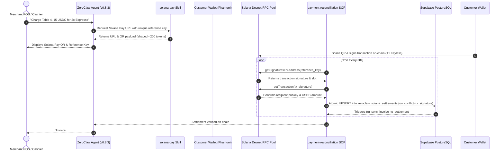

# ZEGA

[](https://github.com/siabang35/zega.ai/actions/workflows/ci.yml)
[](docs/ZEGA_FINAL_HARDENING_REPORT.md)
[](docs/zeroclaw/SECURITY_THREAT_MODEL.md)
[](package.json)
[](package.json)
[](https://solana.com)
[](LICENSE)

> Zero-friction Enterprise Generative AI & Automation (ZEGA) is an agentic execution platform for deploying, orchestrating, governing, and operating AI agents across business workflows.

**Current Repository Showcase**: A ZeroClaw + Solana Pay merchant workflow that demonstrates keyless agent interaction with Solana through ZEGA APIs.

---

## Quick Reference & Navigation

| Resource | Description & Direct Link |
|---|---|
| **Live Production Console** | [https://zegaai.site](https://zegaai.site) *(Solana Devnet Deployment)* |
| **Bounty Showcase Document** | [`ZEROCLAW_SOLANA_BOUNTY_SHOWCASE.md`](ZEROCLAW_SOLANA_BOUNTY_SHOWCASE.md) |
| **Forensic Security Self-Audit** | [`docs/ZEROCLAW_FORENSIC_AUDIT.md`](docs/ZEROCLAW_FORENSIC_AUDIT.md) *(Self-Assessed Score: 91/100 GO)* |
| **Hardening & Test Report** | [`docs/ZEGA_FINAL_HARDENING_REPORT.md`](docs/ZEGA_FINAL_HARDENING_REPORT.md) *(89/89 Test Specs PASS)* |
| **Upstream Integration Guide** | [`docs/book/src/integrations/zega-ai.md`](docs/book/src/integrations/zega-ai.md) *(ZeroClaw Upstream PR #9806)* |
| **Judge Reproducibility Manual** | [`docs/zeroclaw/REPRODUCIBILITY.md`](docs/zeroclaw/REPRODUCIBILITY.md) |

---

## Table of Contents

- [What is Actually Implemented](#what-is-actually-implemented)
- [ZeroClaw Integration Architecture](#zeroclaw-integration-architecture)
- [Solana Pay Merchant Workflow](#solana-pay-merchant-workflow)
- [Architecture & Trust Boundaries](#architecture--trust-boundaries)
- [Security & Custody Model](#security--custody-model)
- [Repository Structure](#repository-structure)
- [Developer Quickstart](#developer-quickstart)
- [ZeroClaw + Solana Quickstart](#zeroclaw--solana-quickstart)
- [Reproducibility & Verification](#reproducibility--verification)
- [Development Commands](#development-commands)
- [Documentation Index](#documentation-index)
- [Security & Vulnerability Reporting](#security--vulnerability-reporting)
- [Project Status](#project-status)
- [Why This Demonstration Matters](#why-this-demonstration-matters)
- [Contributing & License](#contributing--license)

---

## What is Actually Implemented

| Capability | Status | Evidence Location |
|---|---|---|
| **ZeroClaw Rust Binary Integration** | ✅ Implemented | `docs/zeroclaw/config.toml` (ZeroClaw `v0.8.3` spec), `packages/zeroclaw-bridge/` |
| **Telegram Channel Integration** | ✅ Implemented | `docs/zeroclaw/config.toml` (`[channels.telegram]`) |
| **Solana Pay Invoice Generation** | ✅ Implemented | `solana-pay` Skill (`docs/zeroclaw/skills/solana-pay/`) |
| **RPC Settlement Reconciliation** | ⚠️ Devnet Reference | `zeroclawSignatureMonitor.ts`, `zeroclaw.routes.ts` |
| **Human-in-the-Loop Refund Governance** | ✅ Implemented | `refund-approval` SOP (`docs/zeroclaw/sops/refund-approval/`) |
| **OWASP Level 3 Prompt Injection Guard** | ✅ Implemented | `settlementValidation.ts`, `prompt-injection.test.ts` |
| **Local TypeScript Dev Harness** | ⚠️ Development-Only | `scripts/zeroclaw-daemon-harness.ts` (`pnpm zeroclaw:dev-harness`) |
| **Mainnet USDC Settlement** | 🚧 Planned | Roadmap item |

---

## ZeroClaw Integration Architecture

ZEGA integrates with the self-hosted ZeroClaw agent framework by establishing clear boundaries between component layers:

1. **OFFICIAL ZEROCLAW RUST RUNTIME (Primary)**: Self-hosted [ZeroClaw Rust binary](https://github.com/zeroclaw-labs/zeroclaw) (`v0.8.3`) loaded with [`docs/zeroclaw/config.toml`](docs/zeroclaw/config.toml). Handles agent reasoning, SOP execution, and channel I/O.
2. **ZEGA APPLICATION / API LAYER**: Fastify backend service providing Solana RPC pool management, invoice registry, signature monitoring, and Supabase RLS persistence.
3. **ZEGA SKILLS**: Custom skill packages (`solana-pay`, `solana-blinks`, `merchant-memory`, `defi-guardian`) that teach ZeroClaw how to interact with ZEGA API endpoints.
4. **ZEGA SOPS**: Structured Standard Operating Procedures (`payment-reconciliation`, `refund-approval`, `balance-alert`, `defi-guardian`).
5. **DEVELOPMENT HARNESS (Fixture Only)**: Local TypeScript script ([`scripts/zeroclaw-daemon-harness.ts`](scripts/zeroclaw-daemon-harness.ts), executable via `pnpm zeroclaw:dev-harness`). **Classification: Development/test fixture only — not the production/bounty runtime.**

### Integration Architecture Diagram

```text
Merchant / Cashier
   │
   ▼
Telegram / Webhook Channel
   │
   ▼
Official ZeroClaw Rust Runtime (v0.8.3)
   │
   │ ZEGA Skill (solana-pay)
   ▼
ZEGA API (Fastify Backend)
   │
   ├── Invoice Creation & Single-Use Reference Keys
   ├── Solana Pay URL & QR Payload Generation
   ├── RPC Pool Manager (Alchemy, Helius, Solana Devnet)
   └── Signature Monitoring & Settlement Verification
            │
            ▼
        Solana Devnet
```

---

## Solana Pay Merchant Workflow

The primary demonstration workflow executes across the following steps:

1. **Command Trigger**: Merchant or customer issues a request via Telegram or Webhook (e.g., *"Charge Table 4, 15 USDC for 2x Espresso"*).
2. **ZeroClaw Agent Processing**: ZeroClaw Rust runtime evaluates the prompt under the `supervised` risk profile.
3. **Skill Execution**: ZeroClaw calls the `solana-pay` Skill, sending an HTTP request to ZEGA API to generate a single-use reference key.
4. **Solana Pay Request**: ZEGA API returns a formatted `solana:` URL and QR payload (response-shaped `<200 tokens`).
5. **Customer Wallet Signing**: Customer scans the QR code using Phantom or Solflare and signs the transaction directly on Solana Devnet (**Tier 1 Keyless Agent** — agent holds no keys).
6. **RPC Reference Polling**: `payment-reconciliation` SOP polls Solana Devnet RPC every 30s using `getSignaturesForAddress(reference_key)`.
7. **Deterministic Settlement Verification**: ZEGA API queries `getTransaction(tx_signature)`, confirming recipient pubkey, USDC mint (`4zMMC9...`), signature format, and blockTime freshness (<72h).
8. **Atomic Database Persistence**: Settlement data is UPSERTed into Supabase (`tx_signature UNIQUE`), triggering `trg_sync_invoice_to_settlement`.
9. **Merchant Notification**: ZeroClaw notifies the merchant channel of successful settlement (*"Invoice #412 paid ✓"*).

---

## Architecture & Trust Boundaries



### Trust Boundary Isolation

| Architectural Component | Authority & Responsibility | Trust Classification |
|---|---|---|
| **LLM / User Input** | Generates text prompts & invokes skills | **Untrusted Input** (Screened by OWASP regex guard) |
| **ZeroClaw Agent Runtime** | Executes SOP steps & skill HTTP calls | **Supervised Agent** (`transfer` capability blacklisted) |
| **Customer Wallet** | Signs transaction on Solana Devnet | **Client-Side Signer** (Keyless to ZeroClaw & ZEGA) |
| **Solana Devnet Ledger** | Immutable records of transactions and slots | **Public State Anchor** (Queried via RPC pool) |
| **ZEGA Backend API** | Verifies USDC mint, signature format, blockTime | **Deterministic Authority** (Enforces database state) |

> 📌 **Core Security Rule: LLM Output is Not Settlement Authority**  
> Large Language Models (LLMs) propose actions and summarize operational state, but they are **never authoritative** over financial or database state. An agent cannot mark an invoice as paid simply by outputting text. Settlement is exclusively determined by deterministic backend RPC verification against on-chain transaction state.

---

## Security & Custody Model

### Custody Tier: T1 (Keyless Build)

- **Zero Private Key Access**: ZeroClaw and ZEGA API do not store, hold, or access merchant private keys.
- **LLM Private Key Exclusion**: Private keys are never provided to or accessible by the LLM context window.
- **No Autonomous Agent Signing**: The agent cannot autonomously sign customer payments or transfer merchant funds.
- **Client-Side Signing**: Transactions are signed exclusively by customer wallets (Phantom / Solflare).
- **Deterministic Verification**: Settlement status is driven by on-chain RPC lookup, not LLM text generation.

### Security Controls Matrix

| Domain | Control Description | Evidence File Path |
|---|---|---|
| **Risk Profile** | `supervised` profile explicitly blacklists `transfer` and `sign_transaction` | [`docs/zeroclaw/config.toml`](docs/zeroclaw/config.toml) |
| **Human Checkpoints** | `kind: checkpoint`, `policy: merchant-refund`, `quorum: 1` human approval gate | [`docs/zeroclaw/sops/refund-approval/SOP.md`](docs/zeroclaw/sops/refund-approval/SOP.md) |
| **Prompt Injection Defense** | Level 3 regex threat guard screens untrusted input payloads before processing | [`apps/api/src/utils/settlementValidation.ts`](apps/api/src/utils/settlementValidation.ts) |
| **Replay Protection** | PostgreSQL `tx_signature UNIQUE` constraint + API `on_conflict=tx_signature` | [`20260809140000_...sql`](supabase/migrations/20260809140000_fix_vault_settlements_persistence_and_sorting.sql) |
| **Webhook Integrity** | Timing-safe HMAC-SHA256 signature verification (`crypto.timingSafeEqual`) | [`zeroclaw.routes.ts`](apps/api/src/routes/v1/zeroclaw.routes.ts) |
| **RPC Resilience** | Provider pool (Alchemy, Helius, Solana Devnet) with circuit breakers | [`solanaRpcPool.ts`](apps/api/src/services/solanaRpcPool.ts) |

---

## Repository Structure

```text
ZEGA/
├── apps/
│   ├── web/                  # React 18 + Vite + Tailwind CSS Console Frontend
│   └── api/                  # Fastify + TypeScript Backend Service
│       └── src/
│           ├── routes/v1/    # API Routes (Auth, ZeroClaw, Settlements, Enterprise, UMKM)
│           ├── services/     # Solana RPC Pool, Signature Monitor, R2 CDN Storage
│           └── utils/        # Settlement Validation & OWASP Threat Screening
├── packages/
│   ├── zeroclaw-bridge/      # Standalone Typed Gateway Bridge Package (@zega/zeroclaw-bridge)
│   ├── shared/               # Shared Type Definitions & Constants
│   ├── supabase/             # Database Client Factory & Type Schema Mappings
│   └── config/               # Shared Tooling Configurations (ESLint, TypeScript)
├── supabase/migrations/      # Database Schema Migrations & Atomic Triggers
├── docs/
│   ├── ZEROCLAW_FORENSIC_AUDIT.md     # 🛡️ Self-Assessed Forensic Audit (Score 91/100)
│   ├── ZEGA_FINAL_HARDENING_REPORT.md # 🔒 System Hardening Matrix (89/89 Tests PASS)
│   └── zeroclaw/
│       ├── config.toml                # Agent Configuration (T1 Custody, Supervised Profile)
│       ├── sops/                      # 4 Stock SOP Definitions (TOML + MD)
│       └── skills/                    # 4 Stock Skill Specifications (Frontmatter MD)
├── scripts/
│   └── zeroclaw-daemon-harness.ts     # Local Dev/Test Daemon Harness (Fixture Only)
└── .github/workflows/ci.yml  # GitHub Actions CI Workflow
```

---

## Developer Quickstart

### Prerequisites
- **Node.js**: `≥ 20.0.0`
- **pnpm**: `≥ 9.0.0` (enforced via `packageManager` in `package.json`)

### 1. Clone & Install Dependencies

```bash
git clone https://github.com/siabang35/zega.ai.git
cd ZEGA
pnpm install
```

### 2. Configure Environment

Copy the environment template and populate required database and RPC keys:

```bash
cp .env.example .env
```

### 3. Run Development Servers

```bash
pnpm dev
```
- **Web Frontend**: `http://localhost:5173`
- **API Backend**: `http://localhost:3001`

### 4. Run Automated Verification Suite

```bash
pnpm type-check   # TypeScript type validation across all 6 monorepo packages
pnpm build        # Build monorepo production bundles
pnpm test         # Execute 89-test verification suite
```

---

## ZeroClaw + Solana Quickstart

### Primary Path: Production ZeroClaw Rust Binary

1. Obtain the official ZeroClaw Rust binary (`v0.8.3`):
   ```bash
   git clone https://github.com/zeroclaw-labs/zeroclaw.git
   cd zeroclaw
   cargo build --release
   ```
2. Copy ZEGA agent configuration and SOPs:
   - Copy [`docs/zeroclaw/config.toml`](docs/zeroclaw/config.toml) to your ZeroClaw directory.
   - Copy SOPs from [`docs/zeroclaw/sops/`](docs/zeroclaw/sops/) to your ZeroClaw SOPs directory.
3. Start the ZeroClaw Rust daemon:
   ```bash
   ./target/release/zeroclaw --config docs/zeroclaw/config.toml
   ```

### Secondary Path: Local Development Harness *(Development / Test Fixture Only)*

For rapid local testing without building the Rust binary:

```bash
pnpm zeroclaw:dev-harness
```
*Note: This script launches a simulated TypeScript daemon harness on `http://127.0.0.1:4242` for offline unit testing only.*

> 📘 **Step-by-Step Judge Reproducibility Manual:** [`docs/zeroclaw/REPRODUCIBILITY.md`](docs/zeroclaw/REPRODUCIBILITY.md)

---

## Reproducibility & Verification

| Verification Step | Executed Command | Expected Result | Verification Reference |
|---|---|---|---|
| **1. Static Type-Check** | `pnpm type-check` | 6/6 monorepo packages pass with 0 errors | Monorepo root |
| **2. Production Build** | `pnpm build` | 6/6 Turbo build tasks complete successfully | Monorepo root |
| **3. Automated Test Suite** | `pnpm test` | **89 / 89 test specs PASS** across 15 suites | `apps/api/src/__tests__/` |
| **4. RPC Pool Status** | `GET /v1/zeroclaw/rpc-pool/status` | Returns provider pool health metrics | `zeroclaw.routes.ts` |
| **5. Local Dev Harness** | `pnpm zeroclaw:dev-harness` | Starts gateway harness on port 4242 | `zeroclaw-daemon-harness.ts` |

---

## Development Commands

| Command | Action | Execution Target |
|---|---|---|
| `pnpm dev` | Starts React frontend & Fastify backend concurrently | Monorepo root |
| `pnpm dev:web` | Starts React frontend dev server | `@zega/web` |
| `pnpm dev:api` | Starts Fastify backend dev server | `@zega/api` |
| `pnpm build` | Compiles production bundles via Turborepo | All packages |
| `pnpm type-check` | Runs `tsc --noEmit` across all packages | All packages |
| `pnpm test` | Runs automated unit and integration test suite | `@zega/api` |
| `pnpm zeroclaw:dev-harness` | Executes local dev/test daemon harness | Local script |

---

## Documentation Index

| Topic | Document Title & Relative Link |
|---|---|
| **Self-Assessed Audit** | [`docs/ZEROCLAW_FORENSIC_AUDIT.md`](docs/ZEROCLAW_FORENSIC_AUDIT.md) *(Self-Assessed Score: 91/100)* |
| **Hardening Matrix** | [`docs/ZEGA_FINAL_HARDENING_REPORT.md`](docs/ZEGA_FINAL_HARDENING_REPORT.md) *(89/89 Test Specs PASS)* |
| **Bounty Showcase** | [`ZEROCLAW_SOLANA_BOUNTY_SHOWCASE.md`](ZEROCLAW_SOLANA_BOUNTY_SHOWCASE.md) |
| **ZeroClaw Integration** | [`docs/zeroclaw/ZEROCLAW_ZEGA_INTEGRATION_GUIDE.md`](docs/zeroclaw/ZEROCLAW_ZEGA_INTEGRATION_GUIDE.md) |
| **Upstream Guide** | [`docs/book/src/integrations/zega-ai.md`](docs/book/src/integrations/zega-ai.md) *(ZeroClaw Upstream PR #9806)* |
| **Security Threat Model** | [`docs/zeroclaw/SECURITY_THREAT_MODEL.md`](docs/zeroclaw/SECURITY_THREAT_MODEL.md) |
| **Operator Guide** | [`docs/zeroclaw/AGENT_OPERATOR_GUIDE.md`](docs/zeroclaw/AGENT_OPERATOR_GUIDE.md) |
| **RPC Failover Spec** | [`docs/PRD/29-SOLANA-RPC-FAILOVER-MANAGER-SPEC.md`](docs/PRD/29-SOLANA-RPC-FAILOVER-MANAGER-SPEC.md) |

---

## Security & Vulnerability Reporting

Security is an integral part of ZEGA's architecture:
- Do not disclose security vulnerabilities publicly.
- Please submit security disclosures via email or open a private repository security advisory.
- Review our threat model and security boundaries in [`docs/zeroclaw/SECURITY_THREAT_MODEL.md`](docs/zeroclaw/SECURITY_THREAT_MODEL.md).

*Note: The forensic audit report in `docs/ZEROCLAW_FORENSIC_AUDIT.md` represents an internal self-assessed forensic security audit and should not be treated as a third-party audit firm certification.*

---

## Project Status

| Functional Area | Current Status | Technical Notes |
|---|---|---|
| **Platform Monorepo** | Active Development | TypeScript 5.x, Fastify, React 18, Supabase RLS |
| **ZeroClaw Integration** | Reference Implementation | Tested against official ZeroClaw `v0.8.3` Rust binary |
| **Solana Settlement Engine** | Devnet Reference | Reference-key polling on Solana Devnet |
| **Automated Test Suite** | **89 / 89 PASS** | 100% pass rate across API and security test suites |
| **Mainnet Production** | Planned / Roadmap | Mainnet USDC settlement planned for future release |

---

## Why This Demonstration Matters

This reference implementation demonstrates a critical pattern for Web3 agentic systems:

It enforces a strict separation between **non-deterministic AI reasoning** and **deterministic on-chain settlement verification**. The agent can construct unsigned payment requests and summarize merchant telemetry, but on-chain transactions and backend RPC verification remain the sole authority over settlement state.

---

## Contributing & License

Contributions are welcome! Please ensure `pnpm type-check` and `pnpm test` pass cleanly before submitting a Pull Request.

This project is licensed under the [AGPL-3.0 License](LICENSE).  
Copyright © 2026 ZEGA AI ([zegaai.site](https://zegaai.site)).