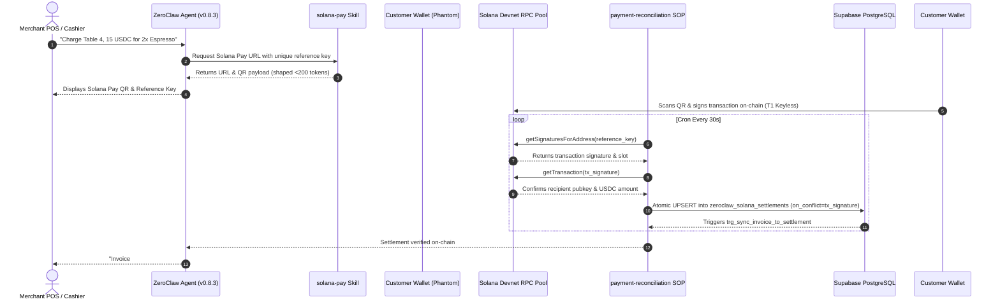

# ZEGA AI

[](https://github.com/siabang35/zega.ai/actions/workflows/ci.yml)
[](docs/ZEGA_FINAL_HARDENING_REPORT.md)
[](docs/zeroclaw/SECURITY_THREAT_MODEL.md)
[](package.json)
[](package.json)
[](https://solana.com)
[](LICENSE)

> Enterprise agentic execution infrastructure for deploying, orchestrating, governing, and operationalizing AI agents across business workflows.

ZEGA (Zero-friction Enterprise Generative AI & Automation) provides a self-hosted, multi-tenant agent management environment. In this repository, ZEGA integrates the official [ZeroClaw](https://github.com/zeroclaw-labs/zeroclaw) Rust framework (`v0.8.3`) to showcase a concrete reference implementation: **keyless Solana Pay invoice generation, RPC settlement reconciliation, and human-in-the-loop refund governance**.

---

## Quick Reference & Navigation

| Resource | Description & Link |
|---|---|
| **Live Production Console** | [https://zegaai.site](https://zegaai.site) *(Solana Devnet Deployment)* |
| **Bounty Showcase Document** | [`ZEROCLAW_SOLANA_BOUNTY_SHOWCASE.md`](ZEROCLAW_SOLANA_BOUNTY_SHOWCASE.md) |
| **Forensic Security Self-Audit** | [`docs/ZEROCLAW_FORENSIC_AUDIT.md`](docs/ZEROCLAW_FORENSIC_AUDIT.md) *(Self-Assessed Score: 91/100 GO)* |
| **Hardening & Test Report** | [`docs/ZEGA_FINAL_HARDENING_REPORT.md`](docs/ZEGA_FINAL_HARDENING_REPORT.md) *(89/89 PASS)* |
| **Upstream Integration Guide** | [`docs/book/src/integrations/zega-ai.md`](docs/book/src/integrations/zega-ai.md) *(ZeroClaw Upstream PR #9806)* |
| **Judge Reproducibility Manual** | [`docs/zeroclaw/REPRODUCIBILITY.md`](docs/zeroclaw/REPRODUCIBILITY.md) |

---

## Table of Contents

- [Why ZEGA?](#why-zega)
- [Current Reference Implementation: ZeroClaw + Solana Pay](#current-reference-implementation-zeroclaw--solana-pay)
- [Architecture & Trust Boundaries](#architecture--trust-boundaries)
- [ZeroClaw Integration](#zeroclaw-integration)
- [Security & Custody Model](#security--custody-model)
- [Capabilities Matrix](#capabilities-matrix)
- [Repository Structure](#repository-structure)
- [Developer Quickstart](#developer-quickstart)
- [ZeroClaw + Solana Quickstart](#zeroclaw--solana-quickstart)
- [Reproducibility & Verification](#reproducibility--verification)
- [Development Commands](#development-commands)
- [Documentation Index](#documentation-index)
- [Security & Vulnerability Reporting](#security--vulnerability-reporting)
- [Project Status](#project-status)
- [Contributing](#contributing)
- [License](#license)

---

## Why ZEGA?

Traditional generative AI integrations generate text responses, but enterprise organizations require **governed agents that execute real business operations safely**.

ZEGA focuses on the core mechanics of production agent execution:
- **Agent Orchestration**: Event-driven workflow triggers (cron schedules and webhook channels).
- **Security Boundaries**: Restricted risk profiles (`supervised`) and strict tool access limits.
- **Human Governance**: Checkpoint approval gates (`kind: checkpoint`) for high-risk operations.
- **Multi-Tenant Isolation**: Database-level Row-Level Security (RLS) policies per workspace.
- **Deterministic Verification**: Separating non-deterministic LLM reasoning from deterministic state transitions.

### Core Architectural Principle: *LLM Output is Not Settlement Authority*

> Large Language Models (LLMs) propose actions and summarize operational state, but they are **never authoritative** over database or financial state. 
> 
> For payment workflows, an agent cannot mark an invoice as paid simply by outputting text. Settlement is exclusively determined by backend RPC verification against on-chain transaction data on Solana.

---

## Current Reference Implementation: ZeroClaw + Solana Pay

ZEGA implements an end-to-end merchant point-of-sale (POS) automation workflow using ZeroClaw:

```text
Merchant / Cashier Channel
        ↓
ZeroClaw Agent (v0.8.3)
        ↓
solana-pay Skill (Generates URL & single-use reference key)
        ↓
Customer Wallet (Phantom / Solflare signs on-chain — T1 Keyless)
        ↓
Solana Devnet RPC Pool (Reference-key detection via getSignaturesForAddress)
        ↓
ZEGA API (Deterministic settlement verification & USDC mint check)
        ↓
PostgreSQL Database (Atomic UPSERT with tx_signature UNIQUE constraint)
        ↓
Merchant POS Notification ("Invoice #412 paid ✓")
```

### Key Technical Properties
1. **Keyless Agent Custody (Tier 1)**: The LLM and ZeroClaw agent never access, hold, or store private keys. Transactions are signed client-side by the customer's wallet.
2. **Replay Protection**: Settlements enforce unique Base58 transaction signatures (`tx_signature`) with atomic database conflict resolution.
3. **Fail-Closed Governance**: Customer refund requests are screened against OWASP Level 3 prompt injection threat patterns before reaching human-in-the-loop approval checkpoints.

---

## Architecture & Trust Boundaries



### Explicit Trust Boundaries

| Architectural Layer | Authority & Responsibility | Trust Model |
|---|---|---|
| **LLM / Prompt Input** | Formats user intent and invokes ZeroClaw skills | **Untrusted Input** (Screened by OWASP regex guard) |
| **ZeroClaw Agent Runtime** | Executes SOP triggers and constructs unsigned URLs | **Supervised Agent** (`transfer` capability blacklisted) |
| **Customer Wallet** | Signs Solana Pay transaction on-chain | **Client-Side Signer** (Keyless to ZEGA & ZeroClaw) |
| **Solana Network** | Immutable ledger of transaction signatures and slots | **Public State Anchor** (Queried via RPC pool) |
| **ZEGA Backend API** | Verifies USDC mint, signature format, and freshness | **Deterministic Authority** (Enforces settlement state) |

---

## ZeroClaw Integration

ZEGA establishes a clear hierarchy between the official ZeroClaw Rust runtime and supporting development tools:

1. **PRIMARY (Production Agent Runtime)**: Official [ZeroClaw Rust Binary](https://github.com/zeroclaw-labs/zeroclaw) (`v0.8.3`) loaded with [`docs/zeroclaw/config.toml`](docs/zeroclaw/config.toml).
2. **SECONDARY (Integration Layer)**: Standalone [`@zega/zeroclaw-bridge`](packages/zeroclaw-bridge/) TypeScript client handling 2-stage pairing (`POST /api/pair` enhanced and `POST /pair` legacy).
3. **DEVELOPMENT ONLY (Test Fixture)**: Local TypeScript daemon harness ([`scripts/zeroclaw-daemon-harness.ts`](scripts/zeroclaw-daemon-harness.ts)) used for offline unit tests and rapid local dev.

### Composed ZeroClaw Components

| Component | Description | File Path |
|---|---|---|
| **SOP — Cron Trigger** | `payment-reconciliation`: Polls pending Solana reference keys every 30s | [`docs/zeroclaw/sops/payment-reconciliation/`](docs/zeroclaw/sops/payment-reconciliation/) |
| **SOP — Channel Trigger** | `refund-approval`: Subscribes to `refund_requested` webhook events | [`docs/zeroclaw/sops/refund-approval/`](docs/zeroclaw/sops/refund-approval/) |
| **SOP — Approval Checkpoint** | `kind: checkpoint`, `policy: merchant-refund`, `quorum: 1` human gate | [`docs/zeroclaw/sops/refund-approval/SOP.md`](docs/zeroclaw/sops/refund-approval/SOP.md) |
| **Skills** | `solana-pay` (URL construction), `solana-blinks`, `merchant-memory`, `defi-guardian` | [`docs/zeroclaw/skills/`](docs/zeroclaw/skills/) |
| **MCP Client (SSE)** | Helius DAS MCP server providing read-only RPC queries | [`docs/zeroclaw/config.toml`](docs/zeroclaw/config.toml) (`[mcp_servers.helius]`) |
| **MCP Client (stdio)** | SendAI Solana MCP server providing Solana Actions tools | [`docs/zeroclaw/config.toml`](docs/zeroclaw/config.toml) (`[mcp_servers.sendai]`) |
| **Risk Profile** | `supervised` profile: auto-approves read queries; **excludes** `transfer` & `sign_transaction` | [`docs/zeroclaw/config.toml`](docs/zeroclaw/config.toml) (`[risk_profiles.supervised]`) |

---

## Security & Custody Model

ZEGA enforces a defense-in-depth security posture designed to eliminate single points of failure:

| Control Domain | Architectural Design | Verification Evidence |
|---|---|---|
| **Private Key Custody** | **Tier 1 (Keyless Agent)**: Agent never holds, generates, or requests private keys. | Excluded in [`config.toml`](docs/zeroclaw/config.toml) risk profile |
| **Transaction Signing** | Client-side wallet signing (Phantom / Solflare). | Solana Pay URL specification |
| **Settlement Authority** | Backend API verifies Base58 signature, USDC mint, and RPC blockTime. | [`apps/api/src/utils/settlementValidation.ts`](apps/api/src/utils/settlementValidation.ts) |
| **Replay Protection** | PostgreSQL `tx_signature UNIQUE` constraint + API `on_conflict=tx_signature`. | [`20260809140000_...sql`](supabase/migrations/20260809140000_fix_vault_settlements_persistence_and_sorting.sql) |
| **Webhook Authentication** | Timing-safe HMAC-SHA256 signature verification (`crypto.timingSafeEqual`). | `zeroclaw.routes.ts` webhook handler |
| **Prompt Injection Defense** | Level 3 regex threat guard screens untrusted input payloads before processing. | [`apps/api/src/__tests__/prompt-injection.test.ts`](apps/api/src/__tests__/prompt-injection.test.ts) |
| **RPC Network Resilience** | 4-tier provider pool (Alchemy, Helius, Official Solana) with circuit breakers. | [`solanaRpcPool.ts`](apps/api/src/services/solanaRpcPool.ts) |

---

## Capabilities Matrix

| Capability Category | Feature Description | Status | Evidence Location |
|---|---|---|---|
| **Agent Runtime** | ZeroClaw Rust binary (`v0.8.3`) integration via `@zega/zeroclaw-bridge` | ✅ Implemented | [`packages/zeroclaw-bridge/`](packages/zeroclaw-bridge/) |
| **SOP Engine** | Cron (`payment-reconciliation`) & Channel triggers (`refund-approval`) | ✅ Implemented | [`docs/zeroclaw/sops/`](docs/zeroclaw/sops/) |
| **Governance Gate** | Human-in-the-loop approval checkpoints (`quorum: 1`) | ✅ Implemented | [`docs/zeroclaw/sops/refund-approval/SOP.md`](docs/zeroclaw/sops/refund-approval/SOP.md) |
| **Solana Settlement** | Reference-key polling, USDC mint validation, Base58 signature check | ⚠️ Devnet Reference | [`apps/api/src/routes/v1/zeroclaw.routes.ts`](apps/api/src/routes/v1/zeroclaw.routes.ts) |
| **RPC Failover** | Multi-provider pool (Alchemy, Helius, Solana) with circuit breakers | ✅ Implemented | [`apps/api/src/services/solanaRpcPool.ts`](apps/api/src/services/solanaRpcPool.ts) |
| **Security Guard** | OWASP Level 3 regex prompt injection threat screening | ✅ Implemented | [`apps/api/src/utils/settlementValidation.ts`](apps/api/src/utils/settlementValidation.ts) |
| **Automated Testing** | 89 passing automated test specs across 15 test suites | ✅ Implemented | [`apps/api/src/__tests__/`](apps/api/src/__tests__/) |
| **Local Dev Harness** | Offline TypeScript daemon harness for rapid testing | 🧪 Dev Only | [`scripts/zeroclaw-daemon-harness.ts`](scripts/zeroclaw-daemon-harness.ts) |
| **Mainnet Deployment** | Production Mainnet real-money settlement deployment | 🗺️ Planned | Roadmap item |

---

## Repository Structure

```text
ZEGA/
├── apps/
│   ├── web/                  # React 18 + Vite + Tailwind CSS Console Frontend
│   └── api/                  # Fastify + TypeScript Backend Service
│       └── src/
│           ├── routes/v1/    # API Routes (Auth, ZeroClaw, Settlements, Enterprise, UMKM)
│           ├── services/     # Solana RPC Pool, Signature Monitor, R2 CDN Storage
│           └── utils/        # Settlement Validation & OWASP Threat Screening
├── packages/
│   ├── zeroclaw-bridge/      # Standalone Typed Gateway Bridge Package (@zega/zeroclaw-bridge)
│   ├── shared/               # Shared Type Definitions & Constants
│   ├── supabase/             # Database Client Factory & Type Schema Mappings
│   └── config/               # Shared Tooling Configurations (ESLint, TypeScript)
├── supabase/migrations/      # Database Schema Migrations & Atomic Triggers
├── docs/
│   ├── ZEROCLAW_FORENSIC_AUDIT.md     # 🛡️ Self-Assessed Forensic Audit (Score 91/100)
│   ├── ZEGA_FINAL_HARDENING_REPORT.md # 🔒 System Hardening Matrix (89/89 Tests PASS)
│   └── zeroclaw/
│       ├── config.toml                # Agent Configuration (T1 Custody, Supervised Profile)
│       ├── sops/                      # 4 Stock SOP Definitions (TOML + MD)
│       └── skills/                    # 4 Stock Skill Specifications (Frontmatter MD)
├── scripts/
│   └── zeroclaw-daemon-harness.ts     # Local Dev/Test Daemon Harness
└── .github/workflows/ci.yml  # GitHub Actions CI Workflow
```

---

## Developer Quickstart

### Prerequisites
- **Node.js**: `≥ 20.0.0`
- **pnpm**: `≥ 9.0.0` (specified via `packageManager` in `package.json`)

### 1. Clone & Install Dependencies

```bash
git clone https://github.com/siabang35/zega.ai.git
cd ZEGA
pnpm install
```

### 2. Configure Environment

Copy the environment template and populate required database and RPC keys:

```bash
cp .env.example .env
```

### 3. Run Development Servers

```bash
pnpm dev
```
- **Web Frontend**: `http://localhost:5173`
- **API Backend**: `http://localhost:3001`

### 4. Run Automated Verification Suite

```bash
pnpm type-check   # TypeScript type validation across 6 packages
pnpm build        # Build monorepo production bundles
pnpm test         # Execute 89-test verification suite
```

---

## ZeroClaw + Solana Quickstart

### Primary Path: Production ZeroClaw Rust Binary

1. Obtain the official ZeroClaw Rust binary (`v0.8.3`):
   ```bash
   git clone https://github.com/zeroclaw-labs/zeroclaw.git
   cd zeroclaw
   cargo build --release
   ```
2. Copy ZEGA agent configuration and SOPs:
   - Copy [`docs/zeroclaw/config.toml`](docs/zeroclaw/config.toml) to your binary directory.
   - Copy SOPs from [`docs/zeroclaw/sops/`](docs/zeroclaw/sops/) to your SOP directory.
3. Start the ZeroClaw Rust daemon:
   ```bash
   ./target/release/zeroclaw --config docs/zeroclaw/config.toml
   ```

### Secondary Path: Local Development Harness *(Dev/Test Fixture Only)*

For quick offline unit testing without building the Rust binary:

```bash
pnpm zeroclaw:dev-harness
```
*Note: This script launches a simulated TypeScript daemon harness on `http://127.0.0.1:4242` for local development only.*

> 📘 **Step-by-Step Judge Reproducibility Manual:** [`docs/zeroclaw/REPRODUCIBILITY.md`](docs/zeroclaw/REPRODUCIBILITY.md)

---

## Reproducibility & Verification

| Step | Executed Command / Action | Expected Result | Verification Reference |
|---|---|---|---|
| **1. Static Check** | `pnpm type-check` | 6/6 monorepo packages pass with 0 errors | Monorepo root |
| **2. Monorepo Build** | `pnpm build` | 6/6 Turbo tasks compile successfully | Monorepo root |
| **3. Test Suite** | `pnpm test` | **89 / 89 test specs PASS** across 15 suites | `apps/api/src/__tests__/` |
| **4. RPC Failover** | `GET /v1/zeroclaw/rpc-pool/status` | Returns provider pool health and status | `zeroclaw.routes.ts` |
| **5. Dev Harness** | `pnpm zeroclaw:dev-harness` | Launches gateway mock harness on port 4242 | `zeroclaw-daemon-harness.ts` |

---

## Development Commands

| Command | Action | Scope |
|---|---|---|
| `pnpm dev` | Starts web frontend & API backend concurrently | Monorepo root |
| `pnpm dev:web` | Starts React frontend dev server | `@zega/web` |
| `pnpm dev:api` | Starts Fastify backend dev server | `@zega/api` |
| `pnpm build` | Compiles production bundles via Turborepo | All packages |
| `pnpm type-check` | Runs `tsc --noEmit` across all packages | All packages |
| `pnpm test` | Runs Jest/Node test runner suite | `@zega/api` |
| `pnpm zeroclaw:dev-harness` | Runs local dev/test daemon harness | Local script |

---

## Documentation Index

| Domain | Document Title & Relative Link |
|---|---|
| **Self-Assessed Audit** | [`docs/ZEROCLAW_FORENSIC_AUDIT.md`](docs/ZEROCLAW_FORENSIC_AUDIT.md) *(Self-Assessed Audit Score: 91/100)* |
| **Hardening Matrix** | [`docs/ZEGA_FINAL_HARDENING_REPORT.md`](docs/ZEGA_FINAL_HARDENING_REPORT.md) *(89/89 Tests PASS)* |
| **Bounty Showcase** | [`ZEROCLAW_SOLANA_BOUNTY_SHOWCASE.md`](ZEROCLAW_SOLANA_BOUNTY_SHOWCASE.md) |
| **ZeroClaw Integration** | [`docs/zeroclaw/ZEROCLAW_ZEGA_INTEGRATION_GUIDE.md`](docs/zeroclaw/ZEROCLAW_ZEGA_INTEGRATION_GUIDE.md) |
| **Upstream Guide** | [`docs/book/src/integrations/zega-ai.md`](docs/book/src/integrations/zega-ai.md) *(ZeroClaw Upstream PR #9806)* |
| **Security Threat Model** | [`docs/zeroclaw/SECURITY_THREAT_MODEL.md`](docs/zeroclaw/SECURITY_THREAT_MODEL.md) |
| **Operator Guide** | [`docs/zeroclaw/AGENT_OPERATOR_GUIDE.md`](docs/zeroclaw/AGENT_OPERATOR_GUIDE.md) |
| **RPC Failover Spec** | [`docs/PRD/29-SOLANA-RPC-FAILOVER-MANAGER-SPEC.md`](docs/PRD/29-SOLANA-RPC-FAILOVER-MANAGER-SPEC.md) |

---

## Security & Vulnerability Reporting

Security is an integral part of ZEGA's architecture. If you discover a vulnerability or potential security issue:
- Do not disclose security vulnerabilities publicly.
- Please submit security disclosures via email or open a private repository security advisory.
- Review our threat model and security boundaries in [`docs/zeroclaw/SECURITY_THREAT_MODEL.md`](docs/zeroclaw/SECURITY_THREAT_MODEL.md).

*Note: The forensic audit report in `docs/ZEROCLAW_FORENSIC_AUDIT.md` represents a self-assessed internal security audit and should not be treated as a third-party audit firm certification.*

---

## Project Status

| Functional Area | Current Status | Notes |
|---|---|---|
| **Platform Monorepo** | Active Development | TypeScript 5.x, Fastify, React 18, Supabase RLS |
| **ZeroClaw Integration** | Reference Implementation | Tested against ZeroClaw `v0.8.3` Rust binary |
| **Solana Settlement Engine** | Devnet Reference | Polling reference keys on Solana Devnet |
| **Automated Test Suite** | **89 / 89 PASS** | 100% pass rate on API and security test suites |
| **Mainnet Production** | Planned / Roadmap | Mainnet USDC settlement planned for future release |

---

## Why This Demonstration Matters

This reference implementation demonstrates a key architectural paradigm for Web3 agentic systems:

It establishes a strict operational boundary between **non-deterministic AI reasoning** and **deterministic on-chain settlement verification**. The agent can construct unsigned payment requests and summarize merchant telemetry, but on-chain transactions and backend verification remain the sole authority over settlement state.

---

## Contributing

Contributions are welcome! Please follow these guidelines:
1. Fork the repository and create a feature branch (`git checkout -b feature/my-feature`).
2. Ensure `pnpm type-check` and `pnpm test` pass cleanly.
3. Open a Pull Request with a detailed summary of your changes.

---

## License

This project is licensed under the [AGPL-3.0 License](LICENSE).  
Copyright © 2026 ZEGA AI ([zegaai.site](https://zegaai.site)).