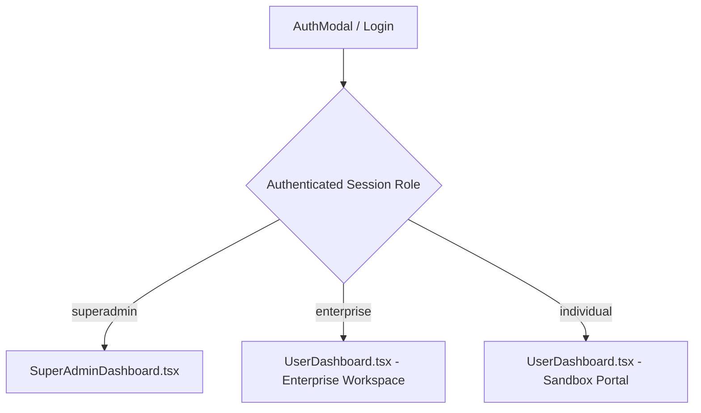

# ZEGA AI PRD — Implemented Features & Technical Status

## 12. Implemented Features & Technical Status (As of July 2026)

### 12.1 Executive Summary of Implementation
The **ZEGA AI Enterprise Orchestration Console** has been implemented as a full-stack platform combining a high-performance React + Vite frontend, a Fastify API server, and a Supabase PostgreSQL backend database with Row-Level Security (RLS).

---

### 12.2 Authentication & Identity Management (`AuthModal`)

The platform implements a enterprise-grade, dual-segment authentication flow designed for seamless onboarding of both individual developers and enterprise organization administrators.

#### A. Segment 1: Individual & UMKM
- **OAuth Providers**: Integrated 1-click **Google** and **GitHub** social sign-in shortcuts.
- **Email Authentication**:
  - Fields: `Email Address` (Placeholder: `user@zega.ai or name@company.com`), `Full Name` (Placeholder: `Alex Morgan`).
  - Action Button: `Continue to ZEGA Portal →`.
- **Target Role Routing**: Directly provisions an `individual` workspace session and opens the User Dashboard Sandbox.

#### B. Segment 2: Enterprise Scale
- **Corporate Registration Fields**:
  - `Work Email` (Placeholder: `enterprise@zega.ai or alex@enterprise.com`).
  - `Company Name` (Placeholder: `Acme Corp`).
  - `Team Size` Dropdown (`1-10`, `10-50`, `50-250`, `250+ employees`).
  - `Primary Objective` Dropdown (`Enterprise Workflow Automation`, `Custom Agent Integration`, `Private VPC / On-Premise Deployment`, `Security & Compliance Audit`).
  - Action Button: `Request Enterprise Demo →`.
- **Security SLA Assurance Badge**: `🛡️ Zero-Trust Architecture • SOC2 Ready • 24/7 Dedicated SLA`.

#### C. Corporate Quick Demo Shortcuts
- **Tab-Aware 1-Click Demo Link**:
  - On Individual tab: `1-Click User Sandbox Mode` → Grants instant demo access to `UserDashboard`.
  - On Enterprise tab: `1-Click Enterprise Demo Mode` → Grants instant demo access to `Enterprise Workspace`.
  - Direct SuperAdmin login via root credentials (`admin@zega.ai`) routes directly to `SuperAdminDashboard`.
- **Modal Lifecycle**: Enforced strict `if (!isOpen) return null` render guards, isolated z-index layer (`z-[99999]`), and explicit `e.stopPropagation()` event handling for the top-right close button (`X`).

---

### 12.3 Role-Based Dashboard Architecture

The frontend (`App.tsx`) enforces dynamic role-based rendering, isolating sensitive SuperAdmin system controls from standard User & Enterprise Workspaces.

#### A. SuperAdmin Dashboard (`SuperAdminDashboard.tsx`)
- **Tenant Management**: Real-time tenant list, subscription plan control (Enterprise Scale, Pro, Sandbox), active status toggling.
- **Platform Analytics**: Global RPC request count, latency distribution (P95/P99), total active agent meshes.
- **AI Safety & Guardrails Enforcement**: PII masking configuration, prompt injection defense rules, rate-limiting rules.
- **Immutable Audit Trail**: Live execution log table tracking authentication events, policy mutations, and API key generation.
- **Role Switcher**: One-click toggle allowing SuperAdmins to view the platform from an Enterprise User perspective without losing credentials.

#### B. User & Enterprise Dashboard (`UserDashboard.tsx`)
- **AI Sandbox Console (`AiSandboxConsole.tsx`)**:
  - Live AI agent playground with customizable system prompts, multi-line user prompt input, real-time response generation, and execution metrics (Token usage, latency in ms, cost calculation).
  - Supported Models: **ZEGA-Omni 4.5**, **Claude 3.5 Sonnet**, **GPT-4o**.
- **Agent Store & Workflow Builder**: Drag-and-drop workflow canvas for orchestrating agent tasks.
- **API Keys & Integrations**: Secure API key creation, copy-to-clipboard, and revocation.
- **Usage Metrics & Billing**: Real-time monthly consumption tracking against tenant quotas.

---

### 12.4 Design System & Aesthetic Specifications

The UI adheres strictly to a **Gaming-Professional Enterprise Design Language**:

1. **Typography**:
   - Primary: `Plus Jakarta Sans` for clean, highly legible interface text and headers.
   - Code & Data Metrics: `Chakra Petch` and `Fira Code` for futuristic gaming-inspired metric cards.
2. **Color Palette & Theme Safety**:
   - Dark Mode: Surface `#0a0b10`, Card Containers `slate-900`/`slate-800`, Accent `#ff6b35` (ZEGA Orange) & `#3b82f6` (Enterprise Blue).
   - Light Mode: High-contrast slate borders, clean white surfaces (`#ffffff`), and crisp text hierarchy.
3. **Card & Console Aesthetics**:
   - Modern square cards with minimal shadow and high-contrast borders.
   - Glassmorphism backdrop blur (`backdrop-blur-xl`) on modal overlays and floating action bars.
   - Clean vertical branding rail (`ZEGA.AI CONSOLE`).

---

### 12.5 Backend & Database Schema (`20260729000000_enterprise_schema_and_security.sql`)

The backend infrastructure utilizes Supabase PostgreSQL with automated schema migrations:

- **Tables Provisioned**:
  - `tenants`: Multi-tenant organization records.
  - `user_profiles`: User accounts linked with roles (`superadmin`, `enterprise`, `individual`).
  - `guardrails_policies`: Safety & compliance rules per tenant.
  - `audit_logs`: Immutable security log storage.
  - `ai_agents`: Active agent metadata and orchestrator state.
- **Row-Level Security (RLS)**: Enforces data isolation so tenants can only read/write their own organization's records.

---

---

### 12.7 Fastify Enterprise Backend, Brevo OTP & Cloudflare Infrastructure

The backend architecture (`apps/api`) has been hardened with OWASP security best practices and integrated with production services:

1. **Transactional Brevo Email OTP Gateway (`BrevoService.ts` & `OtpStore.ts`)**:
   - Sends 6-digit cryptographic verification passcodes via Brevo API v3 (`https://api.brevo.com/v3/smtp/email`).
   - Uses `SMTP_BREVO` key with automated dev fallback simulation.
   - Enforces SHA-256 OTP hashing, 5-minute time-to-live (TTL), and 5-attempt brute-force protection.

2. **Cloudflare Turnstile Bot Defense (`TurnstileService.ts`)**:
   - Verifies Turnstile CAPTCHA tokens via `https://challenges.cloudflare.com/turnstile/v0/siteverify`.
   - Uses `CLOUDFLARE_TURNSTILE_SECRET_KEY` with IP tracking and bypass protection.

3. **Cloudflare R2 / S3 Object Storage CDN (`R2StorageService.ts`)**:
   - Manages asset uploads and generates public CDN URLs (`https://cdn.zegaai.site`).
   - Integrated with `R2_ACCOUNT_ID`, `R2_ACCESS_KEY_ID`, `R2_SECRET_ACCESS_KEY`, and `R2_BUCKET_NAME`.

4. **Fastify OWASP Hardening & Security Middlewares (`auth.routes.ts`)**:
   - `POST /v1/auth/request-otp`: Rate-limited OTP dispatch with bot token verification.
   - `POST /v1/auth/verify-otp`: Validates 6-digit code, resolves user profile/roles (`superadmin`, `enterprise`, `individual`), issues signed JWT session token, and sets secure HTTP-only cookies (`__zega_token`).
   - Body payload limit: 1MB anti-chunking & DoS protection.

---

### 12.8 Summary of Completed Artifacts

| Component | File Path | Status |
|---|---|---|
| Main App Hub & AuthModal | `apps/web/src/app/App.tsx` | Verified & Production Ready |
| Role Router Delegator | `apps/web/src/app/dashboard/UserDashboard.tsx` | Verified & Production Ready |
| Enterprise Dashboard Container | `apps/web/src/app/dashboard/enterprise/EnterpriseDashboard.tsx` | Verified & Production Ready |
| Enterprise Sub-Views | `apps/web/src/app/dashboard/enterprise/views/*.tsx` | Verified & Production Ready (9 Modules) |
| UMKM Dashboard Container | `apps/web/src/app/dashboard/umkm/UmkmDashboardContainer.tsx` | Verified & Production Ready |
| SuperAdmin Console Module | `apps/web/src/app/dashboard/superadmin/SuperAdminDashboard.tsx` | Verified & Production Ready |
| Brevo Email OTP Service | `apps/api/src/services/brevoService.ts` | Verified & Production Ready |
| Turnstile Bot Defense | `apps/api/src/services/turnstileService.ts` | Verified & Production Ready |
| In-Memory OTP Store | `apps/api/src/services/otpStore.ts` | Verified & Production Ready |
| Cloudflare R2 Storage | `apps/api/src/services/r2StorageService.ts` | Verified & Production Ready |
| Auth Routes & JWT | `apps/api/src/routes/v1/auth.routes.ts` | Verified & Production Ready |
| Supabase Service & RBAC | `apps/web/src/app/dashboard/services/supabaseService.ts` | Verified & Production Ready |
| Database Migration SQL | `supabase/migrations/20260729000000_enterprise_schema_and_security.sql` | Executed & Migration Ready |
| ZeroClaw Solana Settlements SQL | `supabase/migrations/20260730233500_zeroclaw_solana_settlements.sql` | Executed & Idempotent Guarded |
| ZeroClaw Fastify API Routes | `apps/api/src/routes/v1/zeroclaw.routes.ts` | Verified & Production Ready |
| ZeroClaw Terminal View | `apps/web/src/app/dashboard/enterprise/views/ZeroClawTerminalView.tsx` | Verified & Chart.js Sparklines |
| UMKM Finance Settlement View | `apps/web/src/app/dashboard/umkm/views/FinanceView.tsx` | Verified & Dual USD/IDR Mode |
| Web Documentation Portal | `apps/web/src/app/DocsPage.tsx` | Verified & Interactive Renderers |
| Modular Enterprise PRD Spec | `docs/PRD/18-MODULAR-ENTERPRISE-DASHBOARD-ROLE-ROUTING-SPEC.md` | Documented & Verified |
| ZeroClaw Solana Integration Spec | `docs/PRD/19-ZEROCLAW-SOLANA-INTEGRATION-SPEC.md` | Documented & Verified |

