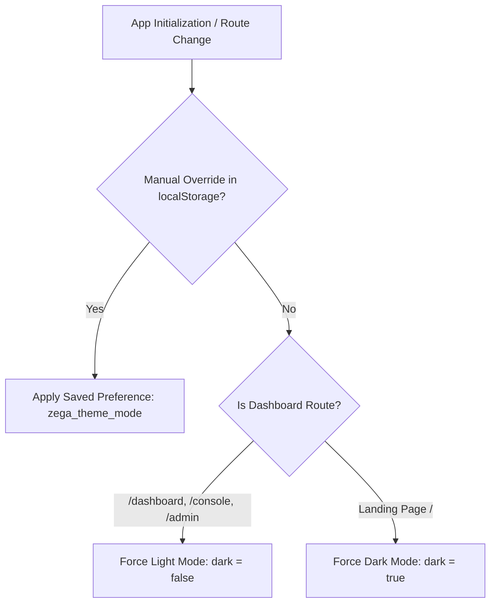

# ZEGA AI PRD — Dashboard Theme, Store CDN Assets, Inbox Avatars & Navigation Spec

## 17. Dashboard Theme Defaults, Cloudflare R2 CDN Store Assets, Inbox Avatars & Dynamic Navigation

### 17.1 Executive Summary
This document details the architectural refinements and visual polish implemented across the **ZEGA AI Platform** dashboard ecosystem, including:
1. **Dynamic Theme Switching Policy**: Mandatory Light Mode default for all Dashboard User Roles (Individual, Enterprise, SuperAdmin) while maintaining Dark Mode default for the public Landing Page (`/`).
2. **Cloudflare R2 CDN Asset Pipeline**: Automated batch uploader script and integration of e-commerce studio product assets stored in Cloudflare R2 CDN (`https://cdn.zegaai.site/assets/products/`).
3. **High-Resolution Customer Avatars**: Full profile photo coverage across **Inbox**, **Home**, and **Customers** dashboard views.
4. **Interactive 3D Video Mascot**: Optimized video placement and interactive speech popover for AI Assistant status.
5. **Dynamic Dashboard Navigation & Routing**: Unified sidebar and tab routing supporting Marketplace, Billing, Settings, Store, Inbox, Knowledge, Sales, Marketing, and Finance.

---

### 17.2 Dynamic Theme Default Policy

The system enforces route-aware theme defaults while persisting manual user overrides in `localStorage`.

- **Landing Page (`/`)**: Initializes in **Dark Mode** (`dark = true`) to deliver a high-impact, futuristic gaming-enterprise visual presentation.
- **Dashboard Views (`/dashboard`, `/console`, `/admin`)**: Automatically initializes in **Light Mode** (`dark = false`) for optimal readability and data density across tabular views and metrics.
- **Persistence Mechanism**:
  - `localStorage.getItem('zega_theme_user_toggled')`: Flag indicating explicit user toggle.
  - `localStorage.getItem('zega_theme_mode')`: Stored preference ('dark' | 'light').

---

### 17.3 Cloudflare R2 CDN E-Commerce Product Assets (`StoreView.tsx`)

The **Store** module product catalog presents 5 core stock items using high-resolution studio assets backed by Cloudflare R2 CDN:

| Product Name | Category | Local Path | Cloudflare R2 CDN URL |
|---|---|---|---|
| Kaos Polos Hitam | Apparel · Cotton Comb 30s | `/assets/products/kaoshitam.png` | `https://cdn.zegaai.site/assets/products/kaoshitam.png` |
| Tumbler Premium | Drinkware · Stainless 500ml | `/assets/products/tumbler.png` | `https://cdn.zegaai.site/assets/products/tumbler.png` |
| Botol Minum 500ml | Drinkware · BPA Free | `/assets/products/botolminum.jpeg` | `https://cdn.zegaai.site/assets/products/botolminum.jpeg` |
| Hoodie Full Zip | Apparel · Fleece Premium | `/assets/products/hoodie.webp` | `https://cdn.zegaai.site/assets/products/hoodie.webp` |
| Totebag Canvas | Accessories · Canvas Drill | `/assets/products/tottebag.jpeg` | `https://cdn.zegaai.site/assets/products/tottebag.jpeg` |

- **Image Rendering**: Encapsulated within `size-12` (Stock Alerts) and `size-9` (Top Selling) containers with `object-contain` framing, smooth background borders, and lazy loading.
- **Batch Asset Uploader**: Managed via `apps/api/src/scripts/uploadAssetsToR2.ts` utilizing S3Client SDK.

---

### 17.4 High-Resolution Customer Avatar System

Profile photos (face avatars) are standardized across all customer touchpoints in the dashboard:

1. **Inbox View (`InboxView.tsx`)**:
   - **Conversation List**: `size-10` rounded avatars with real-time green online status indicators.
   - **Active Chat Header**: Avatar displayed alongside customer name, phone number, and channel badges (WhatsApp, High Priority).
   - **Message Stream**: Customer avatar next to incoming customer bubbles; dedicated `AI` avatar badge next to automated replies.

2. **Home View (`HomeView.tsx`)**:
   - **Recent Conversations Widget**: Customer avatar thumbnails rendered in the real-time communication stream.

3. **Customers View (`CustomersView.tsx`)**:
   - **Top Customers Leaderboard**: Avatar thumbnails integrated into the top customer ranking table.
   - **Customer Activity Stream**: Real-time event log displaying customer profile photos next to transaction events.

---

### 17.5 Interactive 3D Video Mascot & Hero Layout

- **Mascot Video**: `/assets/3D/robotic.mp4` uploaded to Cloudflare R2 (`https://cdn.zegaai.site/assets/3D/robotic.mp4`).
- **Display Container**: Enlarged `size-28 sm:size-32` high-tech display container positioned beside "Good Morning" greeting.
- **Interactive Speech Popover**: Clicking the mascot toggles a floating glassmorphic popover displaying AI Team completion metrics ("126 tasks completed today") with direct navigation shortcut to `My AI Employees`.

---

### 17.6 Verification & Security Compliance

- **Secret Leak Audit**: Confirmed zero API keys, AWS credentials, or secret tokens committed in code or documentation.
- **Build Status**: Web frontend bundle compiles without errors.
