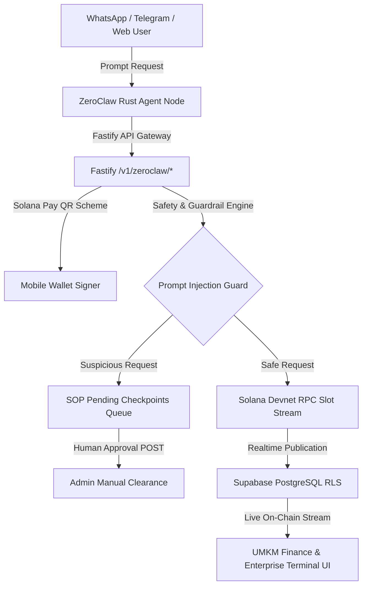

# ZEGA AI PRD — ZeroClaw Solana Agent Runtime & Payment Infrastructure Spec

## 19. ZeroClaw Solana Agent Runtime Integration (July 2026)

### 19.1 Architecture Overview
**ZeroClaw** is a self-hosted, high-performance Rust AI agent runtime integrated into ZEGA AI. It operates under a **Keyless Tier 1 Custody Model**, where zero private keys are stored on server infrastructure. Transactions are signed client-side via Solana wallets (Phantom, Solflare, Backpack) or processed through standardized Solana Pay QR transfer request URIs.

---

### 19.2 Core Specifications & Technical Implementation

#### A. Keyless Tier 1 Custody Model
- **Zero Server Private Keys:** Eliminates server-side key exposure and custodial risk.
- **Client Signatures:** Wallet users maintain full control over keypairs.
- **Standardized Scheme:** `solana:<recipient>?amount=<val>&reference=<refKey>&label=<label>&message=<msg>&spl-token=4zMMC9...`.

#### B. Fastify Microservice Backend Endpoints (`apps/api/src/routes/v1/zeroclaw.routes.ts`)
- `GET /v1/zeroclaw/status`: Returns Rust node health, Keyless Tier 1 custody state, and active messaging channels.
- `GET /v1/zeroclaw/solana-rpc`: Streams live slot numbers and confirmed transaction signatures directly from Solana Devnet RPC.
- `POST /v1/zeroclaw/events`: Generates cryptographic reference keys and records reconciled Solana Pay transactions into Supabase.
- `POST /v1/zeroclaw/approve-checkpoint`: Processes human admin decisions (`approve` / `reject`) for flagged SOP refund checkpoints.

#### C. Database Schema & RLS Hardening (`supabase/migrations/20260730233500_zeroclaw_solana_settlements.sql`)
- **Tables Provisioned**:
  - `zeroclaw_solana_settlements`: Stores signature, amount, currency, slot timestamp, channel, network, and purpose memo.
  - `zeroclaw_sop_checkpoints`: Stores checkpoint ID, prompt injection details, customer channel, recipient address, amount, and status (`pending`, `approved`, `rejected`).
- **Idempotent Migration Policy Guards**:
  - `DROP POLICY IF EXISTS "Users can view owned or public demo settlements" ON zeroclaw_solana_settlements;`
  - `DROP POLICY IF EXISTS "Admins can manage SOP checkpoints" ON zeroclaw_sop_checkpoints;`
  - Prevents SQL deployment failures (`ERROR: 42710`).

---

### 19.3 Financial Features & Role-Separated Reconciliation Streams

#### A. Global Currency Switcher (USDC & IDR)
- **Fixed Exchange Rate:** **1 USD = Rp 18.000 IDR**.
- Applied dynamically across metric summary cards, Chart.js sparkline tooltips, and live stream row amounts.

#### B. Role-Separated Reconciliation Stream Histories
1. **UMKM / Individual User Dashboard (`FinanceView.tsx`):**
   - Retail product sales: `Pay for Product (Cafe Latte x2)` (15.00 USDC / Rp 270.000).
   - Cashier QR settlements: `Kasir QR Settlement` (30.50 USDC / Rp 549.000).
   - Web orders: `Order #8910 - Nasi Goreng Spesial` (8.50 USDC / Rp 153.000).
2. **Enterprise User Dashboard (`ZeroClawTerminalView.tsx` & `EnterpriseDashboard.tsx`):**
   - B2B treasury settlements: `Corporate Treasury B2B Settlement` (1,250.00 USDC / Rp 22.500.000).
   - Multi-agent swarm escrows: `Multi-Agent Swarm Escrow (#8812)` (250.00 USDC / Rp 4.500.000).
   - Supply chain clearing: `Cross-Border Supply Chain Settlement` (500.00 USDC / Rp 9.000.000).

---

### 19.4 Interactive Documentation & Enterprise Swarms (`DocsPage.tsx`)

Documentation on `/docs` includes dedicated interactive renderers for:
- `zeroclaw`: Rust agent node, custody model, REST API reference.
- `solana-pay`: Invoicing standards, merchant presets, Solana Devnet RPC signatures (`Slot 480013691+`).
- `sop-checkpoints`: Prompt injection security workflow and admin review queue.
- `enterprise-zeroclaw`: Multi-agent swarm escrow reference contracts, TOML spending limits (`config.toml`), and ERP Webhook / Supabase Realtime WebSocket streaming (SAP/Salesforce).
