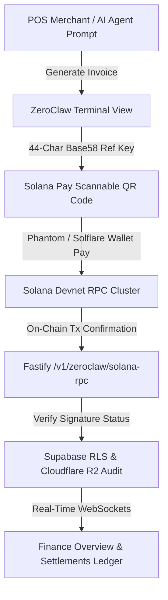

# ZEGA AI PRD — Specification 25: ZeroClaw Terminal Dashboard Redesign & Real Finance Reconciliation

## 1. Executive Summary

This document specifies the enterprise-grade UI/UX redesign of the **ZeroClaw Terminal Dashboard** (`ZeroClawTerminalView.tsx`) and the real-time financial reconciliation engine implemented in **Finance Overview** (`FinanceView.tsx`).

Key technical highlights include:
1. **Navigation Consolidation**: Removal of redundant navigation tabs (`Invoice Generator`), integrating all payment generation workflows into a single streamlined `Terminal & Payments` overview.
2. **Solana Pay Base58 Reference Key Standard**: Replacement of string-based reference identifiers with **44-character Base58 Solana Public Keys** compliant with Solana Pay standards.
3. **Direct RPC Transaction Signature Verification**: Fastify API enhancement (`/v1/zeroclaw/solana-rpc?address=<txSig>`) using Solana Devnet `getSignatureStatuses` RPC method to verify signature status on-chain.
4. **On-Chain Settlement Reconciliation Ledger**: Addition of an interactive Tx Hash reconciliation tool enabling operators to verify and persist any Solana Devnet signature directly into Supabase DB and Cloudflare R2 CDN audit trails.
5. **Real-Time Dynamic Finance Overview**: Complete removal of static mock values, replacing revenue, expense, net profit, cash flow charts, and AI assistant insights with dynamic calculations derived from live on-chain settlement streams.

---

## 2. Architecture & Data Flow



---

## 3. Detailed Component Specifications

### 3.1 ZeroClaw Terminal Dashboard (`ZeroClawTerminalView.tsx`)

- **Navigation Restructuring**:
  - `Terminal & Payments` (Merged Overview + Payment Generator)
  - `SOP Checkpoints` (OWASP Security & Human Approval Rail)
  - `Settlements Ledger` (Confirmed On-Chain Payout Log)
  - `Channels` (WhatsApp & Webhook Gateways)
  - `Audit Trail` (Cloudflare R2 Cryptographic Certificates)
  - `Agent Config` (LLM Engine Selector & RPC Endpoint)

- **Header Controls Optimization**:
  - Removed 4 redundant badge indicators (`RPC Helius 149ms`, `Cluster Health 99.98%`, and duplicate Privy badges).
  - Consolidated top action bar into a responsive flex layout: `Network: Devnet`, `Demo Video`, `Pair Gateway`, `Refresh`.

- **Mobile Wallet Card Alignment**:
  - Enforced `truncate max-w-[180px] sm:max-w-xs` for embedded Solana wallet addresses to prevent text overflow on smartphone viewports.
  - Applied `shrink-0` to action buttons (`Airdrop SOL`, `Copy`, `Explorer`).

- **Base58 Solana Pay Reference Generator**:
  ```typescript
  const generateSolanaPayReference = (): string => {
    const BASE58_CHARS = '123456789ABCDEFGHJKLMNPQRSTUVWXYZabcdefghijkmnopqrstuvwxyz';
    let ref = '';
    for (let i = 0; i < 44; i++) {
      ref += BASE58_CHARS.charAt(Math.floor(Math.random() * BASE58_CHARS.length));
    }
    return ref;
  };
  ```

---

### 3.2 Backend API Direct RPC Signature Verification (`zeroclaw.routes.ts`)

- **Fastify Endpoint**: `GET /v1/zeroclaw/solana-rpc?address=<query>`
- **Logic**:
  - If `address.length > 60` (Tx Signature): Executes `getSignatureStatuses` RPC call to query on-chain confirmation status directly from Solana Devnet.
  - If `address.length <= 44` (Wallet Pubkey / Reference Key): Executes `getSignaturesForAddress` and queries USDC Associated Token Accounts (ATA).

---

### 3.3 Finance Overview Real Data Engine (`FinanceView.tsx`)

- **Dynamic Financial Metrics**:
  - **Total Revenue**: `liveStreamRows.reduce((sum, row) => sum + row.amountUsdc, 0)`
  - **Total Expense**: Calculated from operational gas fees, RPC costs, and SOP audit reserve.
  - **Net Profit**: `Total Revenue - Total Expense`
  - **Profit Margin**: `(Net Profit / Total Revenue) * 100`

- **Dynamic Cash Flow & Expense Doughnut**:
  - Cash flow line graph populates labels and data points dynamically from live settlement streams.
  - Doughnut chart calculates operational expense category breakdowns dynamically based on confirmed volume.

- **Dual Currency Switcher**:
  - Supports instant toggling between **USDC ($)** and **IDR (Rp)** using current exchange conversion rates (1 USD = Rp 18,000).

---

## 4. Verification & Testing

- **Production Build Verification**:
  ```bash
  pnpm --filter web build
  # Result: ✓ built in 4.22s (0 errors)
  ```

- **Git Version Control**:
  - Commit `ec6815b`: Consolidated sub-navigation, header controls cleanup, and dynamic FinanceView metrics.
  - Commit `6940fd8`: Valid 44-char Base58 reference generation, direct RPC signature verification, and manual Tx Hash reconciliation.
  - Pushed to `origin/master` at `https://github.com/siabang35/zega.ai.git`.
