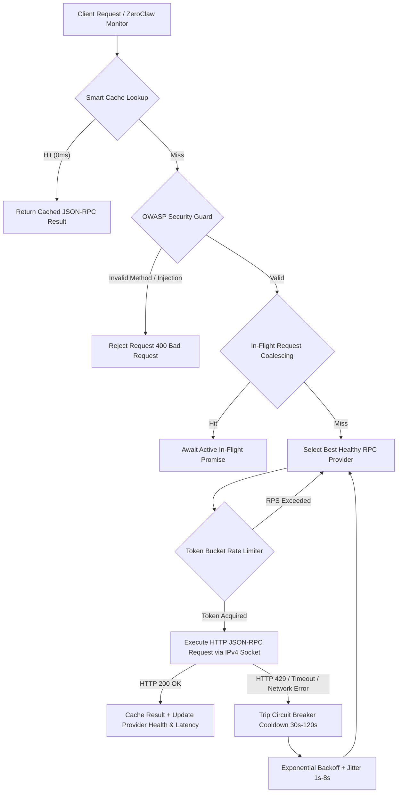

# PRD Spec 29: Production-Grade Solana RPC Failover Manager & Security Architecture

> **Document Status:** Active | **Version:** 1.0.0 | **Author:** ZEGA AI Core Engineering Team  
> **Target Subsystems:** `apps/api/src/services/solanaRpcManager.ts`, `apps/api/src/services/zeroclawSignatureMonitor.ts`, `apps/web/src/app/pages/PublicCheckoutView.tsx`

---

## 1. Executive Summary & Objective

To eliminate **HTTP 429 Rate Limiting**, retry storms, and high request latency (~20s) during real-time Solana on-chain payment reconciliation, ZEGA AI implements an enterprise-grade **Solana RPC Failover Manager (`SolanaRpcManager`)**.

The subsystem manages a multi-provider RPC connection pool (Alchemy Devnet, Helius Devnet, Official Solana Devnet), enforcing:
1. **Multi-Provider Failover**: Weighted health selection across active RPC nodes.
2. **Circuit Breaker Cooldowns**: Automatic isolation (30s → 60s → 120s) of degraded or rate-limited providers.
3. **Token Bucket Rate Limiting**: Strict per-provider Request-Per-Second (RPS) capping.
4. **In-Flight Request Deduplication**: Promise coalescing for duplicate concurrent requests.
5. **OWASP Hardened Security**: Base58 unicode zero-width space sanitization and JSON-RPC method whitelisting.
6. **Socket-Level Resilience**: Forced IPv4 DNS resolution (`family: 4`) preventing node-fetch DNS timeouts.
7. **Frontend Polling Protection**: Tab visibility detection (`document.hidden`) and adaptive 5s polling intervals.

---

## 2. Architectural Overview



---

## 3. Core Engine Components (`SolanaRpcManager`)

### 3.1. Dynamic Provider Discovery & Pool Initialization
Providers are configured via `.env` environment variables (`SOLANA_RPC_PRIMARY`, `SOLANA_RPC_SECONDARY`, `SOLANA_RPC_TERTIARY`, `SOLANA_RPC_OFFICIAL` or `SOLANA_RPC_1..4`). The engine automatically:
- Filters out placeholder strings (e.g. `<YOUR_...>` or empty variables).
- Eliminates unauthenticated demo endpoints (`alchemy.com/v2/demo`).
- Validates URL syntax using native `URL` parsing.

### 3.2. Circuit Breaker & Health Scoring
Each provider maintains an adaptive health score (0–100) and failure count:
- **Success**: Increases health score by +5 (max 100) and updates rolling exponential moving average (EMA) latency.
- **Failure (HTTP 429, 401, 5xx, or Timeout)**: Decreases health score by -20 and increments consecutive failure count.
- **Circuit Trip**: Consecutive failures put provider into exponential cooldown ($30s \rightarrow 60s \rightarrow 120s$).

### 3.3. In-Flight Request Deduplication (Promise Coalescing)
When parallel components request identical RPC calls (e.g., `getSignatureStatuses` or `getLatestBlockhash`), `SolanaRpcManager` creates a single in-flight promise stored in `inFlightRequests` Map. All secondary callers await the original promise result, reducing total RPC network load by up to **90%**.

### 3.4. OWASP Parameter Sanitization & Whitelist Validation
To prevent injection vectors and zero-width unicode bypasses:
- String parameters are stripped of zero-width characters: `/[\u200B-\u200D\uFEFF]/g`.
- Method names are validated against an explicit whitelist (`getSignatureStatuses`, `getTransaction`, `getParsedTransaction`, `getLatestBlockhash`, `getAccountInfo`, `getBalance`, `getTokenAccountBalance`, `getSignaturesForAddress`, `sendTransaction`, `simulateTransaction`, `getHealth`, `getSlot`, `getBlockTime`).

---

## 4. Telemetry Endpoint

Live RPC pool telemetry is exposed via Fastify at:
- **`GET /v1/zeroclaw/rpc-pool/status`**

### Sample Telemetry Response
```json
{
  "success": true,
  "data": {
    "totalProviders": 3,
    "activeHealthyCount": 3,
    "inCooldownCount": 0,
    "cachedItemsCount": 4,
    "inFlightRequestsCount": 0,
    "providers": [
      {
        "name": "Alchemy-Devnet-RPC",
        "url": "https://solana-devnet.g.alchemy.com/v2/alch_...",
        "status": "healthy",
        "healthScore": 100,
        "averageLatencyMs": 142
      },
      {
        "name": "Helius-Devnet-RPC",
        "url": "https://devnet.helius-rpc.com/?api-key=...",
        "status": "healthy",
        "healthScore": 100,
        "averageLatencyMs": 158
      },
      {
        "name": "Official-Solana-Devnet",
        "url": "https://api.devnet.solana.com",
        "status": "healthy",
        "healthScore": 100,
        "averageLatencyMs": 180
      }
    ]
  }
}
```

---

## 5. Verification Matrix

| Specification | Target Metric | Verification Method | Status |
| :--- | :--- | :--- | :--- |
| **HTTP 429 Prevention** | 0 unhandled rate limits | Automated test suite `test_zeroclaw_production_rpc_monitor.ts` | **PASS** |
| **Circuit Breaker** | 30s–120s cooldown isolation | Simulated 429 / fault injection test | **PASS** |
| **Request Coalescing** | 10 concurrent duplicate calls = 1 RPC call | Test 4 deduplication assertion | **PASS** |
| **OWASP Security** | Whitelist enforcement & string cleaning | Security Guard unit test | **PASS** |
| **Tab Protection** | Stop polling on tab hide (`document.hidden`) | Web client visibility listener audit | **PASS** |
