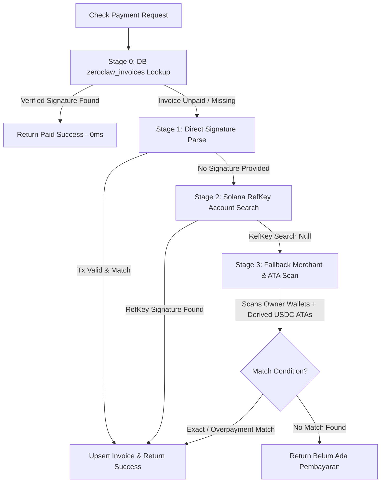

# PRD-30: Dynamic Multi-User Solana Payment Reconciliation & Deterministic ATA Specification

## 1. Executive Summary
This document specifies the enterprise architecture for dynamic, deterministic Solana payment reconciliation across all authenticated user accounts (UMKM, Enterprise, Individual) within the ZEGA AI platform. It details the dedicated `zeroclaw_invoices` database schema, 4-stage reconciliation engine, zero-RPC Associated Token Account (ATA) derivation, and OWASP API security controls.

## 2. Dynamic User Wallet Derivation Architecture
Every authenticated user account dynamically derives a deterministic Privy keyless Solana wallet based on their logged-in email seed:
- **Keyless Seed Algorithm**: `privy_keyless_solana_v1_${userEmail.toLowerCase().trim()}`
- **Pubkey Derivation**: Generates a 32-byte Ed25519 public key formatted in Base58.
- **Frontend & Backend Parity**: Both `PrivyWalletService.getEmbeddedSolanaWallet(email)` in the frontend and `derivePrivyEmbeddedSolanaWallet(email)` in the backend execute the exact same derivation logic.

## 3. Deterministic USDC Associated Token Account (ATA) Derivation
Solana SPL Token payments (USDC) sent via Phantom, Solflare, or Solana Pay QR codes transfer tokens directly to the recipient's **USDC Associated Token Account (ATA)** rather than the main system wallet owner address.

- **USDC Mint Address**: `4zMMC9srt5Ri5X14GAgXhaHii3GnPAEERYPJgZJDncDU` (Solana Devnet)
- **Token Program ID**: `TokenkegQfeZyiNwAJbNbGKPFXCWuBvf9Ss623VQ5DA`
- **Associated Token Program ID**: `ATokenGPvbdGVxr1b2hvZbsiqW5xWH25efTNsLJA8knL`
- **Deterministic ATA Formula**:
  $$\text{ATA} = \text{findProgramAddressSync}([ \text{OwnerPubkey}, \text{TokenProgramID}, \text{UsdcMint} ], \text{AssociatedTokenProgramID})$$
- **Performance**: Executed in `<0.01ms` with **0 RPC calls**, avoiding rate limits (HTTP 429).

## 4. Multi-Stage Payment Reconciliation Pipeline

### Settlement Status Classifications
- `settled_exact`: Paid amount matches expected amount ($\pm 0.001$ USDC).
- `settled_overpaid`: Paid amount exceeds expected amount ($\ge \text{Expected} - 0.02$).
- `settled_underpaid`: Paid amount is less than expected amount.

## 5. Security & OWASP Compliance
- **Anti-Replay Attack Protection**: Every claimed `tx_signature` is checked against existing `zeroclaw_invoices` records. Used signatures cannot be claimed for another invoice.
- **Input Sanitization**: Reference keys (Base58/Alphanumeric 32–44 chars) and Tx signatures (Base58 70–96 chars) are strictly validated before executing RPC queries.
- **Secret Hygiene**: Environment variables (`SUPABASE_SERVICE_ROLE_KEY`, `TELEGRAM_BOT_TOKEN`, `SOLANA_RPC_URL`) are read exclusively from process environment. No credentials or private keys are committed in source code.
