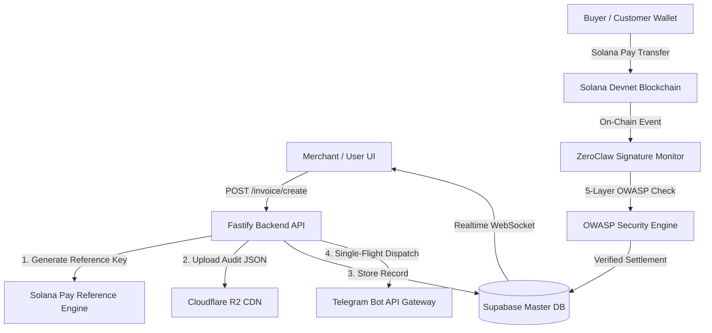

# PRD 36: ZeroClaw Hardened Invoice Delivery, Supabase Realtime DB & CDN Vault Specification

## 1. Executive Summary

This document specifies the enterprise architectural hardening of the **ZeroClaw Invoice Delivery Engine** and **Reconciliation Vaults** within the ZEGA AI ecosystem (v3.2.0).

Key achievements:
1. **Single-Flight Dispatch Engine**: Unified invoice generation through `/v1/zeroclaw/invoice/create` as the canonical dispatcher, eliminating duplicate Telegram notifications.
2. **5-Layer OWASP Anti-Hacking Guard**: Implemented strict Base58 signature validation, zero-amount transfer rejection, anti-replay lock, and active reference key verification in `zeroClawSignatureMonitor.ts` to prevent false positive payment receipts.
3. **Cloudflare R2 CDN Cryptographic Audit Certificates**: Automated generation and upload of JSON audit certificates (`r2CdnUrl`) containing SHA-256 checksums and Privy wallet metadata for every created invoice.
4. **Supabase Realtime WebSockets**: Integrated WebSocket subscriptions (`postgres_changes`) on `zeroclaw_invoices` and `zeroclaw_solana_settlements` for sub-100ms real-time vault updates without page reloads.
5. **State Diffing Guard**: Added `lastInvoiceFingerprintRef` in `ZeroClawTerminalView.tsx` to eliminate re-render lag and achieve 60fps tab navigation.

---

## 2. Architecture & Data Flow

---

## 3. 5-Layer OWASP Anti-Hacking Engine

| Layer | Validation | Implementation Detail |
|---|---|---|
| **Layer 1** | Amount Validation | Rejects zero, negative, or NaN payment amounts. |
| **Layer 2** | Base58 Format Guard | Enforces 87-88 Base58 alphanumeric characters for transaction signatures. Rejects synthetic/fake IDs (`sol_...`, `gen_inv_...`). |
| **Layer 3** | Anti-Replay Guard | Tracks processed signatures in `processedSignaturesSet` to prevent signature reuse across multiple invoices. |
| **Layer 4** | On-Chain RPC Verification | Queries Solana Devnet RPC (`getSignatureStatuses`) to confirm execution success and slot height on-chain. |
| **Layer 5** | Recipient & Reference Matching | Inspects `parsedTx`: verifies recipient matches merchant wallet public key and active invoice `reference_key`. Rejects phantom/unmatched transactions. |

---

## 4. Database Schema & Supabase Realtime

### 4.1 Invoices Table (`zeroclaw_invoices`)
- `id`: UUID Primary Key
- `user_id`: User Email / Privy UUID
- `merchant_pubkey`: Merchant Solana Address (Privy Embedded Wallet)
- `amount_usdc`: Decimal Nominal (USDC)
- `reference_key`: Solana Pay Reference Key (Base58, 32-44 chars)
- `memo`: Invoice Memo String
- `solana_pay_url`: Formatted `solana:...` URI
- `r2_cdn_url`: Cloudflare R2 Audit Certificate URL
- `status`: `active` | `confirmed` | `cancelled`
- `settlement_status`: `settled_exact` | `settled_underpaid` | `settled_overpaid`
- `customer_target`: Customer Telegram `@username` or Phone
- `created_at`: Timestamptz

### 4.2 Reconciled Settlements Table (`zeroclaw_solana_settlements`)
- `id`: UUID Primary Key
- `reference_key`: Invoice Reference Key
- `merchant_pubkey`: Merchant Address
- `amount_usdc`: Settled Amount (USDC)
- `tx_signature`: Solana On-Chain Transaction Signature (Base58, 87-88 chars)
- `status`: `confirmed`
- `created_at`: Timestamptz

---

## 5. Security & Zero Secret Exposure Compliance

All backend services enforce zero hardcoded credential rules:
- `SUPABASE_URL` / `SUPABASE_SERVICE_ROLE_KEY`: Resolved from `.env` via `envConfig`.
- `TELEGRAM_BOT_TOKEN`: Resolved dynamically without fallback literals.
- `R2_ACCESS_KEY_ID` / `R2_SECRET_ACCESS_KEY`: Secured in environment configuration.
- **Sanitized Logging**: All RPC URLs and API keys pass through `sanitizeRpcUrl` to strip sensitive credentials before log serialization.

---

## 6. Verification & Status

- **Build Verification**: `apps/api` (0 errors) & `apps/web` (0 errors)
- **Production Domain**: `https://zegaai.site`
- **Git Commit**: `139fc93` (Merged on `master` & `danz` branches)
