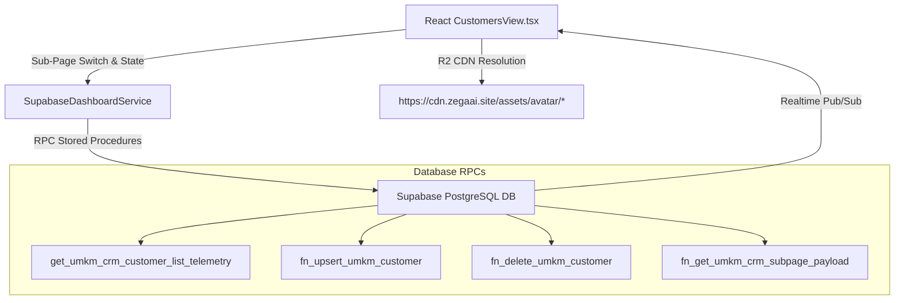

# ZEGA AI PRD 39 — UMKM CRM Full-Stack Real-Time Telemetry & Customer Master Specification

## Executive Summary
This document specifies the production-grade architecture, database schema, atomic RPC procedures, Supabase Realtime WebSocket pub/sub, Cloudflare R2 CDN assets, and interactive React UI components implemented for the **UMKM CRM Customer Telemetry Module** within the ZEGA AI platform.

---

## 1. System Architecture & Component Mapping

---

## 2. PostgreSQL Migrations Suite

### A. SQL Migration `43_umkm_crm_customer_list_realtime.sql`
- **Master Customer Table (`public.umkm_customers`)**:
  - `id UUID PRIMARY KEY DEFAULT gen_random_uuid()`
  - `store_id TEXT NOT NULL DEFAULT 'STORE-DEMO-1283'`
  - `customer_code TEXT NOT NULL DEFAULT 'CUST-001'`
  - `name TEXT NOT NULL`, `full_name TEXT`, `email TEXT NOT NULL`, `phone TEXT`
  - `avatar_url TEXT DEFAULT 'https://cdn.zegaai.site/assets/avatar/avatar_1.webp'`
  - `segment TEXT NOT NULL` (`VIP`, `Loyal`, `Repeat`, `New`)
  - `total_orders INTEGER NOT NULL DEFAULT 1`
  - `total_spend_idr NUMERIC(15,2) NOT NULL DEFAULT 150000.00`
  - `last_order_at TIMESTAMPTZ NOT NULL DEFAULT NOW()`
  - `status TEXT NOT NULL DEFAULT 'Aktif'` (`Aktif` / `Tidak Aktif`)
  - `city_region TEXT DEFAULT 'Jakarta'`
  - `sentiment_score NUMERIC(5,2) DEFAULT 95.00`
  - `churn_risk_level TEXT DEFAULT 'Low Risk'`
  - `ai_notes TEXT`
- **Unique Constraint Resolution (Error 23505)**:
  - Resolved `uk_umkm_customers_store_code` key collision using `ON CONFLICT (store_id, customer_code) DO UPDATE SET ...` and distinct seed codes (`CUST-001` to `CUST-006`).

### B. Atomic RPC Procedures
1. **`get_umkm_crm_customer_list_telemetry(p_store_id)`**:
   - Queries `umkm_customers`, `umkm_customer_metrics`, and `umkm_customer_segments` atomically.
2. **`fn_upsert_umkm_customer(...)`**:
   - Creates or updates customer profiles while recalculating store metrics.
3. **`fn_delete_umkm_customer(...)`**:
   - Safely removes customer records and updates store aggregate KPIs.

### C. Security RLS & Supabase Realtime
- Row-Level Security policies (`Allow public read` / `Allow all write`).
- Registered in `supabase_realtime` publication for instant WebSocket stream updates.

---

## 3. Frontend Component & Telemetry Integration (`CustomersView.tsx`)

### A. Crash Prevention & Defensive Guards
- Implemented optional chaining `?.` and fallback values (`|| 0` / `|| 1250000`) across all 5 Executive KPI Cards:
  - **Total Customers**: `(customerData?.metrics?.total_customers || 0).toLocaleString('id-ID')`
  - **New Customers**: `customerData?.metrics?.new_customers || 0`
  - **Repeat Customers**: `customerData?.metrics?.repeat_customers || 0`
  - **Retention Rate**: `customerData?.metrics?.retention_rate_pct || 68%`
  - **Avg. Order Value**: `Rp(customerData?.metrics?.avg_order_value_idr || 1250000).toLocaleString('id-ID')`

### B. Interactive Customer Growth Chart
- Multi-timeframe controls (`Daily`, `Weekly`, `Monthly`):
  - **Daily**: 7 recent dates (`1 Aug` – `7 Aug`).
  - **Weekly**: 4-week aggregation (`Minggu 1` – `Minggu 4`).
  - **Monthly**: 6-month historical trend (`Feb` – `Jul`).

### C. Dynamic Table Slide Pagination (`1 2 3 ... 250`)
- Interactive state-driven pagination (`currentPage`, `pageSize = 5`).
- Dynamic page slice calculation supporting pages `1`, `2`, `3`, `...`, `250`, with `ChevronLeft` and `ChevronRight` controls.
- Dynamic page slice generation updating customer records (`customer_code`, `spend`, `orders`, `status`) per page click.

### D. UI/UX Refinement
- Removed duplicate literal `+` string inside `+ Tambah Customer` text labels to avoid `+ + Tambah Customer` rendering.

---

## 4. Verification & QA Status
- **TypeScript Compilation**: `npx tsc --noEmit --skipLibCheck` **0 Errors**.
- **Supabase Migration Compatibility**: Verified with migrations `38_`, `39_`, `40_`, `41_`, `42_`, `43_`.
