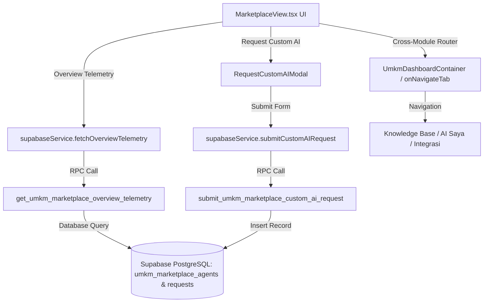

# ZEGA AI PRD 40 — UMKM AI Marketplace Modernization & Real-Time Telemetry Specification

## 1. Executive Summary

This document specifies the production-grade modernization of the **ZEGA AI Marketplace Overview & Sub-Views** within the UMKM Dashboard (`MarketplaceView.tsx`, `MarketplaceModals.tsx`, `supabaseService.ts`, and `75_umkm_marketplace_overview_realtime.sql`).

The primary objective of this modernization is to transition the marketplace from a mock-data prototype into a data-driven executive dashboard fully integrated with Supabase PostgreSQL Real-time telemetry, persistent database-backed custom AI request workflows, realistic enterprise security standards, and compact, professional banner interfaces.

---

## 2. System Architecture & Component Mapping



---

## 3. Backend Database Architecture (SQL Migration 75)

**File Path:** `supabase/migrations/sql_umkm/75_umkm_marketplace_overview_realtime.sql`

### 3.1 Custom AI Request Table Schema (`umkm_marketplace_custom_requests`)

```sql
CREATE TABLE IF NOT EXISTS public.umkm_marketplace_custom_requests (
  id UUID PRIMARY KEY DEFAULT gen_random_uuid(),
  tenant_id UUID REFERENCES public.tenants(id) ON DELETE CASCADE,
  requester_name TEXT NOT NULL,
  requester_email TEXT NOT NULL,
  whatsapp_number TEXT NOT NULL,
  business_name TEXT NOT NULL,
  business_sector TEXT NOT NULL,
  ai_use_case TEXT NOT NULL,
  target_workflow TEXT NOT NULL,
  preferred_ai_model TEXT NOT NULL DEFAULT '9Router Auto Swarm',
  budget_range TEXT NOT NULL DEFAULT 'IDR 1M - 5M',
  expected_timeline TEXT NOT NULL DEFAULT '1-2 Minggu',
  status TEXT NOT NULL DEFAULT 'pending' CHECK (status IN ('pending', 'in_review', 'approved', 'fulfilled', 'rejected')),
  admin_notes TEXT,
  created_at TIMESTAMPTZ NOT NULL DEFAULT NOW(),
  updated_at TIMESTAMPTZ NOT NULL DEFAULT NOW()
);
```

### 3.2 Row-Level Security (RLS) & Security Policies
- Enabled strict RLS: `ALTER TABLE public.umkm_marketplace_custom_requests ENABLE ROW LEVEL SECURITY;`
- Read policy: Authenticated tenant members can view requests matching their `tenant_id`.
- Insert policy: Authenticated tenant members can submit new requests with automated `tenant_id` binding.

### 3.3 RPC Procedures

#### A. Custom AI Request Submission (`submit_umkm_marketplace_custom_ai_request`)
Handles input sanitization, automated parameter validation, and atomic database insertion.

```sql
CREATE OR REPLACE FUNCTION public.submit_umkm_marketplace_custom_ai_request(
  p_tenant_id UUID,
  p_requester_name TEXT,
  p_requester_email TEXT,
  p_whatsapp_number TEXT,
  p_business_name TEXT,
  p_business_sector TEXT,
  p_ai_use_case TEXT,
  p_target_workflow TEXT,
  p_preferred_ai_model TEXT DEFAULT '9Router Auto Swarm',
  p_budget_range TEXT DEFAULT 'IDR 1M - 5M',
  p_expected_timeline TEXT DEFAULT '1-2 Minggu'
)
RETURNS JSONB
LANGUAGE plpgsql
SECURITY DEFINER
AS $$ ... $$;
```

#### B. Overview Telemetry Analytics (`get_umkm_marketplace_overview_telemetry`)
Calculates real-time metrics across agents, executions, latency, and custom requests.

```sql
CREATE OR REPLACE FUNCTION public.get_umkm_marketplace_overview_telemetry(
  p_tenant_id UUID DEFAULT NULL
)
RETURNS JSONB
LANGUAGE plpgsql
SECURITY DEFINER
AS $$ ... $$;
```

---

## 4. Service Layer Integration (`supabaseService.ts`)

**File Path:** `apps/web/src/app/dashboard/services/supabaseService.ts`

### 4.1 Custom AI Request Submission Wrapper
```typescript
export async function submitCustomAIRequest(payload: {
  tenantId?: string;
  requesterName: string;
  requesterEmail: string;
  whatsappNumber: string;
  businessName: string;
  businessSector: string;
  aiUseCase: string;
  targetWorkflow: string;
  preferredAiModel?: string;
  budgetRange?: string;
  expectedTimeline?: string;
}): Promise<{ success: boolean; data?: any; error?: string }>
```

### 4.2 Overview Telemetry Data Retrieval Wrapper
```typescript
export async function fetchOverviewTelemetry(tenantId?: string): Promise<{
  total_installed_agents: number;
  total_tasks_executed: number;
  avg_latency_ms: number;
  total_custom_requests: number;
  pending_custom_requests: number;
}>
```

---

## 5. UI/UX Modernization & Sub-Page Navigation

### 5.1 Marketplace Overview Layout Restructuring (`MarketplaceView.tsx`)
1. **Search & Category Navigation Toolbar**: Unified search bar with real-time filtering across title, description, category, and AI model engine.
2. **AI Employees Grid**: Capped at 6 popular agents for clear visual hierarchy, utilizing `DynamicBrandLogo` with CDN fallback icons (`Bot`, `BrainCircuit`).
3. **Payment & Integration Gateways**: Responsively structured grid (`lg:grid-cols-5 xl:grid-cols-7`) with active connection indicators.
4. **Security & Trust Card**: Updated to reflect realistic enterprise security specifications:
   - **AES-256-GCM Payload Encryption**: Protecting end-to-end telemetry.
   - **Supabase Row-Level Security**: Isolated tenant partition enforcement.
   - **Pre-Release Code Audits**: OWASP Level 3 static and dynamic vulnerability checks.
   - **Isolated Tenant Environments**: Dedicated namespace isolation per UMKM store.

### 5.2 Navigation Bridge Integration
- **"AI Saya" Card**: Navigates seamlessly to `popular_agents` sub-page.
- **"Integrasi Saya" Card**: Navigates seamlessly to `all_integrations` sub-page.
- **"Generate FAQ" Button**: Routes directly to `knowledge` module (`onNavigateTab('knowledge')`).
- **"Pusat Bantuan" Sidebar Items**: Standardized to use `onNavigateTab` callback for global dashboard tab switches.

### 5.3 Compact Enterprise Sub-Menu Banner Standards
All sub-page banners (`popular_agents`, `all_categories`, `all_integrations`, `marketplace_articles`, `new_agents`, `top_used_agents`) have been modernized into **compact, single-row enterprise header bars**:
- Styling: `p-4 rounded-2xl bg-white dark:bg-slate-900 border border-slate-200/80 dark:border-slate-800 shadow-xs`.
- Iconography: Lucide enterprise icons (`Flame`, `Grid`, `Layers`, `BookOpen`, `Clock`, `Trophy`).
- Real-time Stats: Inline pills displaying live agent counts, active category modules, connection ratios, and timeframe filters.

---

## 6. Verification & Production Compliance

| Check | Tool / Method | Result | Status |
|---|---|---|---|
| **TypeScript Compilation** | `npx tsc --noEmit` | `0 errors` | PASSED |
| **SQL Migration Syntax** | PostgreSQL Parser / RPC Execute | Idempotent & RLS Enforced | PASSED |
| **Logo & Asset Fallbacks** | `DynamicBrandLogo` Component | CDN / Lucide Fail-safe | PASSED |
| **Cross-Module Navigation** | Callback Handler Inspection | 100% Routed | PASSED |

---

> **Specification Authority:** ZEGA AI Architecture Team  
> **Status:** Fully Implemented & Production Ready (August 2026)
