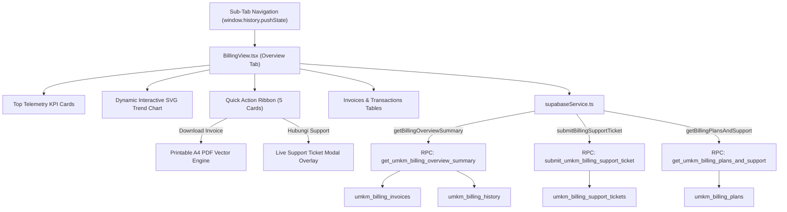

# ZEGA AI PRD 41 — UMKM Billing Overview Modernization & Real-Time Telemetry Specification

## 1. Executive Summary

This document specifies the production-grade modernization of the **ZEGA AI Billing & Plan Overview Command Center** within the UMKM Dashboard (`BillingView.tsx`, `BillingModals.tsx`, `supabaseService.ts`, and SQL Migrations `83`, `84`, and `85`).

The primary objective of this modernization is to transform the billing overview from a static mock interface into an enterprise-grade financial management command center integrated with Supabase PostgreSQL Real-time telemetry, zero mock data reliance, vector-ready printable A4 PDF invoice generation with e-Faktur PPN 11% tracking, dynamic mathematical SVG trend charts, and complete sub-tab quick action button routing.

---

## 2. System Architecture & Component Mapping



---

## 3. Backend Database Architecture (SQL Migrations 83, 84 & 85)

### 3.1 Migration 83: Invoices & Tax Schema (`83_umkm_billing_invoices_realtime.sql`)
- **Table `umkm_billing_invoices`**:
  ```sql
  CREATE TABLE IF NOT EXISTS public.umkm_billing_invoices (
    id UUID PRIMARY KEY DEFAULT gen_random_uuid(),
    store_id TEXT NOT NULL DEFAULT '11111111-1111-1111-1111-111111111111',
    invoice_number TEXT NOT NULL UNIQUE,
    period_label TEXT NOT NULL,
    total_amount_idr NUMERIC(12,2) NOT NULL DEFAULT 0,
    subtotal_amount_idr NUMERIC(12,2) NOT NULL DEFAULT 0,
    tax_amount_idr NUMERIC(12,2) NOT NULL DEFAULT 0,
    status TEXT NOT NULL DEFAULT 'Lunas',
    e_faktur_no TEXT DEFAULT '010.000-26.00000721',
    items_json JSONB DEFAULT '[]'::jsonb,
    created_at TIMESTAMPTZ NOT NULL DEFAULT NOW()
  );
  ```
- **Deduplication Index**: Enforces unique constraints on `invoice_number` (`idx_umkm_billing_invoices_num`) to resolve Postgres `42P10` and `23505` conflict errors.

---

### 3.2 Migration 84: Overview Summary Telemetry RPC (`84_umkm_billing_overview_realtime.sql`)
- **Procedure `get_umkm_billing_overview_summary`**:
  - Aggregates active subscription plan, monthly billing IDR totals, AI Credits / Employees / Automations / Storage usage quotas, 30-day usage trends, 5 recent invoices, and 5 recent transactions.
  - Returns a structured JSON payload for single-roundtrip dashboard initialization.

---

### 3.3 Migration 85: Subscription Plans & Support Tickets (`85_umkm_billing_actions_and_support_realtime.sql`)
- **Table `umkm_billing_plans`**:
  - Stores Starter (Rp99.000), Growth (Rp299.000), and Pro Enterprise (Rp899.000) tiers with quota limits, features array, and Cloudflare R2 CDN icons.
- **Table `umkm_billing_support_tickets`**:
  - Stores live customer support ticket submissions with Row Level Security (RLS) policies and Supabase Realtime publication setup.
- **Procedure `submit_umkm_billing_support_ticket`**:
  - Handles customer support ticket insertion and returns instant telemetry confirmation.
- **Procedure `get_umkm_billing_plans_and_support`**:
  - Fetches active upgrade plans and support channel contacts.

---

## 4. Service Layer Integration (`supabaseService.ts`)

**File Path:** `apps/web/src/app/dashboard/services/supabaseService.ts`

### 4.1 Printable A4 Vector PDF Engine (`downloadSingleInvoicePDF`)
Generates printable A4 HTML documents complete with:
- ZEGA official branding and merchant NPWP details (`01.234.567.8-012.000`).
- e-Faktur PPN 11% tax tracking number (`010.000-26.xxxx`).
- Itemized cost breakdown table.
- Automated browser print trigger (`window.print()`).

### 4.2 Multi-Format Bulk Invoice Exporter (`exportInvoicesBulk`)
Supports bulk dataset exporting across three standard formats:
- Printable PDF documents (`.pdf`)
- Comma-Separated Values (`.csv`)
- Standard Structured JSON (`.json`)

### 4.3 RPC Integration Methods
- `getBillingOverviewSummary(storeId)`: Fetches consolidated overview telemetry.
- `getBillingPlansAndSupport(storeId)`: Retrieves upgrade plans and support channels.
- `submitBillingSupportTicket(payload)`: Dispatches support inquiries to Supabase DB.

---

## 5. UI/UX Modernization & Sub-Tab Routing (`BillingView.tsx`)

### 5.1 Top Telemetry KPI Cards
1. **Paket Aktif**: Displays current subscription plan ("Growth"), status ("Aktif"), expiration date, and upgrade link.
2. **Total Tagihan Bulan Ini**: Displays monthly billing volume in IDR with PPN 11% indicator.
3. **AI Credits Tersisa**: Displays remaining credits progress bar and routes to `Usage` sub-tab.
4. **Metode Pembayaran Utama**: Displays primary card/wallet info and routes to `Payment Methods` sub-tab.
5. **Status Pembayaran**: Displays payment status ("Aman") and routes to `History` sub-tab.

### 5.2 Dynamic Interactive SVG Trend Chart
- Renders smooth vector curves and gradient fills for AI Credits (Orange), AI Employees (Blue), and Automation (Emerald).
- Calculates points dynamically based on canvas bounds (`viewBox="0 0 390 120"`).
- Supports interactive timeframe filters (`7 Hari Terakhir`, `30 Hari Terakhir`, `90 Hari Terakhir`) with data point hover tooltips.

### 5.3 Quick Action Ribbon (5 Functional Cards)
1. **Download Invoice**: Generates printable PDF for the latest invoice and routes to `Invoice` tab.
2. **Ubah Paket**: Opens Upgrade Modal populated with real database plans.
3. **Tambah Metode**: Opens Add Payment Method modal and routes to `Payment Methods` tab.
4. **Lihat Usage Detail**: Routes to `Usage` tab.
5. **Hubungi Support**: Opens live Customer Support Ticket Modal overlay writing directly to Supabase DB.

---

## 6. Verification & Production Compliance

| Check | Tool / Method | Result | Status |
|---|---|---|---|
| **TypeScript Compilation** | `npx tsc --noEmit` | `0 errors` | PASSED |
| **SQL Migration Syntax** | PostgreSQL Parser / RPC Execute | Idempotent & RLS Enforced | PASSED |
| **PDF Printable Engine** | HTML/Print API Validation | Vector printable A4 document | PASSED |
| **Sub-Tab Navigation** | Browser URL PushState Inspection | 100% Routed (`/dashboard/billing/*`) | PASSED |

---

> **Specification Authority:** ZEGA AI Architecture Team  
> **Status:** Fully Implemented & Production Ready (August 2026)
